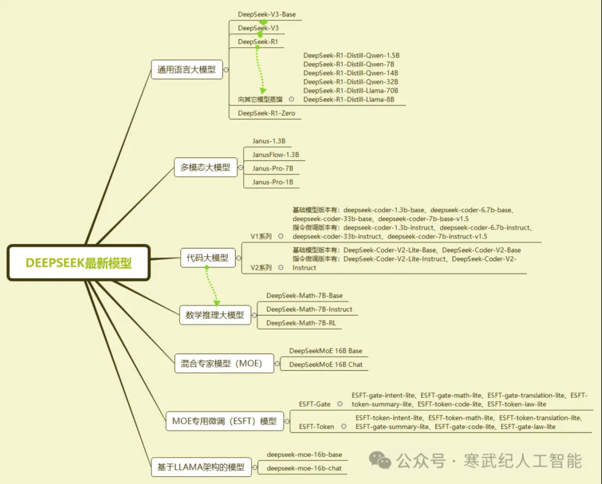
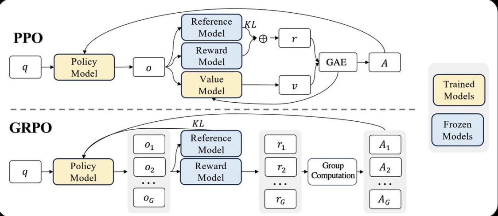

# DeepSeek

## 蒸馏（Distillation）

### 架构设计

#### 教师模型和学生模型的选择

- 教师模型：使用 DeepSeek-R1，该模型具有 671B 参数，具有强大的推理能力和广泛的知识覆盖
- 学生模型：基于 Qwen 和 Llama 系列模型（计算效率和内存占用方面表现出色）

#### 架构设计的关键点

**层次化特征提取**

- 教师模型在处理输入数据时，会生成多层次表示，这些特征表示包含了数据的丰富语义信息
- 通过这个特征表示，能够更好地理解数据的结构和模式

**多任务适应性**

- 学生模型不仅学习教师模型输出，还针对不同的任务需求进行优化

### 训练过程与优化方法

#### 训练数据的准备

**数据来源**

- 训练数据主要来自教师模型生成推理的数据样本
- DeepSeek 使用教师模型对大量输入数据进行处理，生成高质量的输出数据，这些数据作为学生模型的训练样本
- 数据增强：通过对原始数据进行扩展、修改和优化，生成了丰富的训练数据样本，从而提高了学生模型的学习效率

**训练过程**

- 监督微调：学生模型通过学习教师模型的输出概率分布，调整自身参数，以尽可能接近教师模型的输出
- 损失函数设计：在训练过程中，DeepSeek 设计了混合损失函数，结合了软标签损失和硬标签损失。软标签损失鼓励学生模仿教师模型输出的概率分布，而硬标签损失则确保学生模型正确预测真实标签

#### 优化方法

- 温度参数调整：较高的温度参数可以使分布更加平滑，从而帮助学生模型更好地学习教师的输出
- 动态学习率调整：根据训练进度和模型性能动态调整学习率，确保模型在训练过程中的稳定性和收敛速度
- 正则化技术：为了避免过度拟合，使用 L2 正则化项来约束模型的参数，防止模型过于复杂，从而提高模型的泛化能力

### 蒸馏模型的性能表现

**计算资源优化**

- 模型的参数大幅减少：

`
DeepSeek-R1-Distill-Qwen-7B 的参数量仅为 7B，相比原始的 DeepSeek-R1（671B 参数）
`

- 内存占用减少：

`
DeepSeek-R1-Llama-8B 内存占用仅为原始模型的 1/80 左右
`

- 推理速度提升：

`
DeepSeek-R1-Distill-Qwen-32B 的推理速度比原始模型提高了约 50 倍
`

## DeepSeek 模型

### 通用语言模型

#### DeepSeek-V3-Base

`
从零开始预训练的模型。采用 MLA 和 DeepSeekMoE 框架，预训练使用 14.8 万亿个高质量、多样化的 token 进行训练。引入了多 token 预测（MTP），首次在大规模模型上验证了 FP8 混合精度训练框架的有效性，通过多种并行策略显著提高训练效率。
`

#### DeepSeek-V3

`
基于 DeepSeek-V3-Base，通过后训练阶段优化。采用监督微调（SFT），使用 150 万条指令数据涵盖多个领域；强化学习（RL） 方面，采用规则基础和基于模型的奖励模型，通过 GRPO 优化。
`

#### DeepSeek-R1-Zero

`
基于 DeepSeek-V3-Base，直接应用强化学习（RL） 训练，无需依赖监督微调（SFT）。采用 GRPO 算法，奖励模型由准确性和格式奖励组成，设计了简单模板要求模型先产生推理过程再提供答案。
`

#### DeepSeek-R1

`
基于 DeepSeek-V3-Base，通过多阶段训练和冷启动数据优化。收集数千条长推理链（CoT） 数据进行微调，强化学习类似 DeepSeek-R1-Zero。但使用冷启动数据七点，拒绝采样和监督微调结合替他领域的数据再训练，全场景强化学习进一步对齐人类偏好。
`

#### 蒸馏模型

`
从 DeepSeek-R1 模型中蒸馏推理能力得到能力更强的模型，包括 Qwen 和 Llama 等。
`

## GRPO (Group Relative Policy Optimization)

### How GRPO works?

- model generates a group of answers
- compute score for each answer
- compute avg score for entire group
- compare each answer score to avg score
- reinforce model to favor higher answer

### Example

#### Query: What is 2 + 3?

**Step 1: LLM generates three answer**

- 5
- 6
- 2 + 3 = 5

**Step 2: Each answer is scored**

- 5 -> 1 points（correct, no reasoning）
- 6 -> 0 points (incorrect)
- 2 + 3  = 5 -> 2 points (correct, reasoning)

**Step 3: Compute avg score for entire group**

- Avg score = (1 + 0 + 2) / 3 = 1

**Step 4: Compare each anser score to avg**

- 5 -> 0 (same as avg)
- 6 -> 1（below avg）
- 2 + 3 = 5 -> 1 (above avg)

**Step 5: Reinforce LLM to favor higher scores**

- Favor response like #3 (positive)
- Maintain response like #1（neutral） 
- Avoid response like #2 (negative)

**Reference**

- [深度解析 DeepSeek 蒸馏技术](https://mp.weixin.qq.com/s/BDQ75O3MNePGmkFd5iscjw)
- [一文搞懂 DeepSeek 大模型的版本及关系](https://mp.weixin.qq.com/s/BjzWewpt8FYt1_gyVBsqog)
- [The Illustrated DeepSeek-R1](https://substack.com/inbox/post/155812052)
- [Twitter: GRPO - group relative policy optimization](https://x.com/virattt/status/1885102056546910672?s=46&t=ulYQEDJ7GQSP3RJjsg3CJw)
