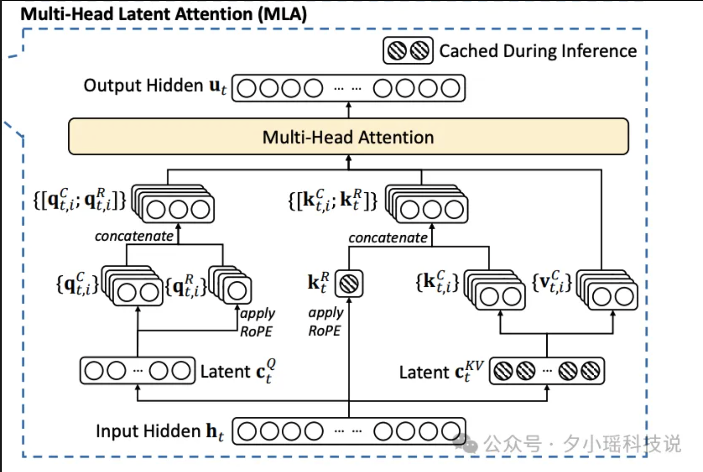
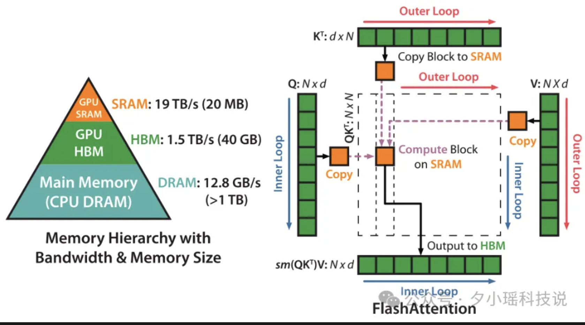

# FlashMLA

`
FlashMLA is an efficient MLA decoding kernel for Hopper GPUs, optimized for variable-length sequences serving.
`

`
明确写了是针对 Hopper 系列优化，也就是 H800 的卡所用的架构
`

## 关键点

- 针对 Hopper GPU 优化
- 一个 MLA 解码内核
- 专门处理可变长度序列

**核心技术**

- 低秩矩阵压缩：MLA 使用低秩矩阵，将 KV 缓存压缩为潜向量，减少内存占用。通过解压潜向量生成独特的 KV 头
- 针对 GPU 优化：FlashMLA 针对 Hopper GPU 的 Tensor Code 进行优化，实现了可达 3000 GB/s 的显存带宽和 580 TFLOPS 的计算性能
- Row-wise/Block-wise 优化：细粒度划分，在 shared memory 中原位处理计算，减少额外的中间计算过程的显存占用，减少显存访问次数
- Split-KV 分块处理：将 KV 拆分给多个 SM（Stream MultiProcessor）处理（或者多次迭代），然后在局部被 partial 计算结果合并

### MLA

**在注意力机制中引入 "潜变量（Latent Variable）":**

- 通过某种方式（例如：一个线性层或一个简单的神经网络）从输入序列 X 生成一组潜变量 Z
- 在潜变量 Z 上来应用多头注意力机制

`
MLA 可以捕捉输入序列中潜在的、抽象的特征或模式，而且潜变量通常是低纬的，可以大大降低计算复杂度，提高计算效率。MLA 结构从 DeepSeek-V2 论文中首次提出，在之后发布的所有 DeepSeek 主模型里面都有沿用。
`

### Cache 

`
KV 缓存是现在主流大模型存储上下文数据的一种存储机制，通过在大模型推理时不断被复用来节省大模型的推理开销，一般会被存放在显存/内存中。
`

传统的 MHA 里，每个注意力头独立计算和存储键（K）和值（V），导致 KV 缓存随着头数和序列增加而增大。MLA 则把多个头的 KV 键值对，映射到一个共享的低维潜在空间，利用低秩矩阵分解实现联合压缩。与标准的注意力机制相比，MLA 的 KV 缓存大小减少了接近九成。

在推理时，通过缓存之前计算的键值对，避免重复计算，从而节省计算资源和时间。比如 DeepSeek-V3 在长文生成任务中推理速度提高了 1.5 倍。

### 借鉴 FlashAttentionV2&V3

`
传统注意力面对可变序列的时候，往往会因为输入文本的长度不同，面临显存和访存延迟的问题。FlashMLA 另一个重要优化的点就是针对不同的文本输入，即可变长序列，做了优化。
`

可变长序列（variable-length）主要指在同一批次（batch）中，不同输入样本可以拥有不同的序列长度，而不需要将所有序列统一填充到相同长度。

FlashMLA 做了和 PagedAttention 类似的工作，进行了分页 KV 存储管理，它实现了基于 64-block 粒度的分页 KV 缓存，极大地缓解了内存访问瓶颈。同时设计了双缓冲预加载机制，在计算当前块的时候，会异步加载下一个块到共享内存，让显存访问和计算过程同步进行，减小了延迟开销。

`
在实际测试中 H800 上可以达到 3000 GB/s 的内存带宽和 580 TFLOPS 的计算性能（H800 理论的内存带宽最高约为 3.35 TB/s，已经接近商业化产品的极限了）
`

## 总结

- 本质上是通过将计算过程分解成线程块片（thread block tile）、线程束片（wrap tile）和线程片（thread tile）的层次结构，将矩阵乘法累加的策略应用到这些结构，从而高效地完成基于 CPU 拆分的 tile 的 GEMM
- 硬盘极限优化（3000 GB/s 内存带宽、580 TFLOPS 算力）、核心压缩技术（压缩 93.3% 的 KV 缓存），将 Hopper CPU 的性能榨取到极致

**Reference**

- [FlashMLA 这张王牌太狠了](https://mp.weixin.qq.com/s/cWobYvXEHSxjEIPe5pzvKQ)
- [Github FlashMLA](https://github.com/deepseek-ai/FlashMLA/tree/main)