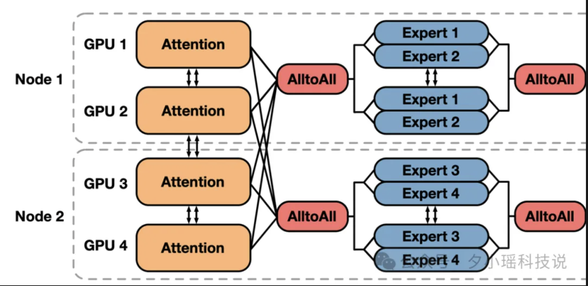
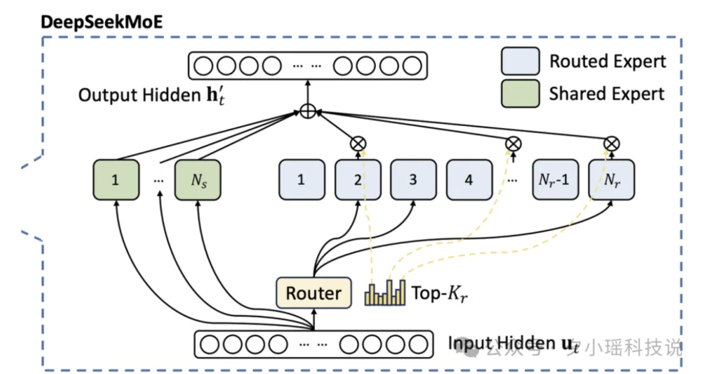
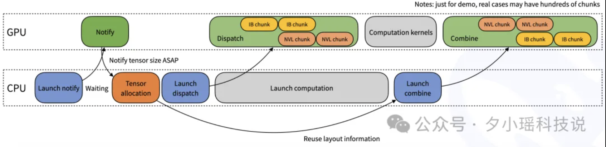
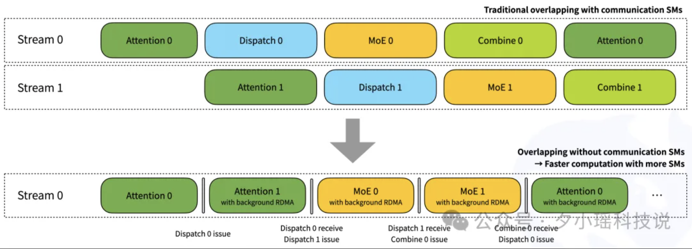

# DeepEP

**Expert Parallelism, EP（专家并行）主要用在混合专家模型（Mixture of Exports）**

## 概览

**DeepEP 首个用于 MoE 模型训练和推理的开源 EP 通信库，用于训练和推理的高吞吐量和低延迟**

- 实现高效的 all-to-all 通信
- 提供高吞吐（NVLink + RDMA）与低延迟（纯 RDMA）两套通信内核，兼顾大批量训练与实时推理场景
- 支持 NVLink 和 RDMA 的节点内 / 跨节点通信
- 通过 SM 数量控制接口，可在计算与通信之间灵活分配 GPU 资源
- 集成可以重叠通信和计算的 hook 机制，允许在解码时后台并行接收数据，不占用任何 SM 资源
- 原生 FP8 调度支持

## MoE 的瓶颈

**Mixture of Experts**

- EP（Expert Parallelism）是一种并行计算方式，主要用在混合专家模型（MoE）中
- 将不同的 "专家"（模型的子网络）分配到不同的计算设备（如 GPU）上
- 根据输入数据的特点，选择合适的专家来处理
- 多个专家可以同时并行工作，提高整体计算效率

MoE 模型在每次推理时，并不是所有专家都参与计算，而是根据输入数据的需求，只激活一部分。

`
比如 DeepSeek-R1，它的实际参数大小为 671B（实际还有 14B 的 MTP 投机解码模块），在每次推理的时候，只激活 37B 的参数量，256 个专家里激活 8 个。在这个过程中，每个设备会根据路由规则，将自身的数据发送到相应专家所在的设备上，然后等待专家完成计算后再将结果返回到原设备。
`

**上面的过程中，每个设备会根据路由规则，将自身的数据发送到相应专家所在的设备上，然后等待专家完成计算后将结果返回给原设备**

## NVLink & RDMA (Remote Direct Memory Access)

- NVLink 相当于 "城内高速路"，负责同一个节点内 GPU-GPU 之间的高速通信，带宽可达百 GB/s 级，极大提升了单机多卡之间的数据交换效率
- RDMA 相当于 "跨城高速公路"，负责跨节点通信，直接让一台服务器的 GPU 与另一台服务器的 CPU 之间进行远程读写，跳过 CPU，有效避免多层网络的额外延迟，带宽通常在几十 GB/s 级

## DeepEP 的设计

### 高吞吐内核优化

针对高吞吐场景，DeepEP 提供了一组同时适用于训练和推理预填充任务的通用内核。它可以直接将数据从 NVLink 域转发到 RDMA 域，提供非常高的吞吐量

`
已知 NVLink 的最高带宽是 160GB/s, DeepEP 在实现专家并行时，实测带宽最高可以达到 153GB/s，无限接近极限值
`

### 低延迟内核

针对延迟敏感的大模型解码环节，只使用 RDMA（远程直接显存访问）以最小化延迟

`
完全依照 RDMA 后的延迟在各专家并行的程度下均达到微妙级，最高达到 46GB/s（理论极限 50GB/s）
`

### 等待 - 通知机制

`在实际的分发阶段，往往无法提前知道当前这个阶段会接收多少个 tokens？`

- CPU 端先发起相应操作，然后在等待状态下监听 GPU 的进度
- 当 GPU 收到分发或合并指令并完成相应工作后，会将结果或状态告知 CPU
- 当 CPU 收到信号后，再启动下一阶段的调度和计算

### 基于 hook 的通信 - 计算重叠法

- 流式多处理器 (Streaming Multiprocessor: SM), GPU 的基本计算单元，每个 SM 都能运行成百上千个线程（为模型运算提供惊人的吞吐力）

`
如果通信速度无法跟上 Token 和专家并行度的需求，SM 等不到数据就会 "闲置"，从而导致 GPU 资源浪费。如何在保证大规模分发/聚合的同时，让 SM 最大化利用？
`

1. 在使用 NVDIA 的 H800 GPU 训练 V3 时，对 GPU 的核心计算单元（SM，流多处理器）进行了定制化调整，把 132 个 SM 中的 20 个专门用来处理服务器间的通信任务，而不是计算任务

#### Hook 的原理

`
解决问题：在现代计算机系统中，计算任务和数据通信往往是并行的，但传统的处理方式经常导致计算资源和通信资源的利用率不高，尤其是在等待数据传输完成时，计算单元常常处于空闲状态。DeepEP 创新性地采用了 Hook 机制，实现了计算与通信的巧妙重叠，从而显著提升了系统性能和资源利用率。
`

**什么是 Hook 机制？**

- 计算机技术中的一种强大机制，它允许程序 拦截（intercept）和修改（modify）操作系统、应用程序的执行流程
- 允许用户自定义的代码介入并执行，从而实现对原有流程的干预

**DeepSeek 如何利用 Hook 机制实现计算与通信重叠？**

- 通信发起 Hook (Send Hook)

`
当应用程序调用发送数据的函数时（send() 或 MPI_Send()），DeepSeek 的 Hook 会被触发。在这个 Hook 函数中，DeepEP 不会立即阻塞等待数据发送完成，而是将发送操作放入后台异步执行。与此同时，主线程可以立即返回并继续执行后续的计算任务
`

- 通信完成 Hook（Receive Hook/Completion Hook）

`
当后台数据发送或接收操作完成时，DeepEp 的另一个 Hook 会被触发。这个 Hook 函数负责处理通信结果，例如，将接收到的数据传递给应用程序，或者唤醒等待通信结果的计算任务
`

## DeepEP 的潜在场景

- 高性能计算（HPC）：在科学计算，工程模拟等 HPC 应用中，计算节点之间需要频繁地交换数据。DeepEP 可以有效提升 HPC 应用的并行效率和性能
- 分布式机器学习/深度学习：在训练大模型时，数据并行和模型并行都需要节点之间进行梯度或参数的同步。DeepEP 加速分布式训练过程，缩短模型训练时间
- 大数据处理与分析：在处理海量数据时，数据传输往往成为瓶颈。DeepEP 可以优化数据处理流程，提升大数据分析效率
- 实时系统与网络应用：对于延迟敏感的实时系统和网络应用，DeepEP 可以降低通信延迟，提高系统的实时性和响应时间

**Reference**

- [拉爆 MoE 训练和推理](https://mp.weixin.qq.com/s/cp8VRdzV0bkIzYWCh0mOFA)
- [GutHub DeepEP](https://github.com/deepseek-ai/DeepEP)
- [Hook 机制：DeepEP 中实现计算与通信的高效重叠](https://blog.csdn.net/mieshizhishou/article/details/145882855)
