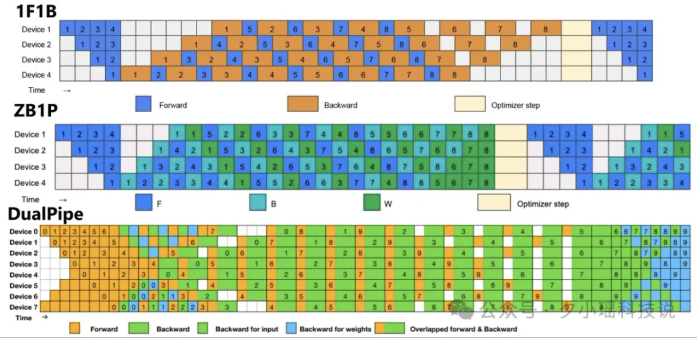

# Day4_DualPipe

## 概览

**DualPipe**

- 负责提升通信效率，确保信道均衡

**EPLB**

- 负责优化专家副本分配，确保不同的 GPU 节点的负载均衡

`
相比于 FlashMLA 和 DeepGEMM，DualPipe 和 EPLB 更多偏向于工程优化
`

`
存在问题：AI 训练里，把模型分成几块，每块扔给一个 GPU，大家同时处理不同的数据，效率蹭蹭网上涨。但是传统管道并行有个毛病：CPU 之间需要来回传数据，有时候就像接力赛跑，交棒时没对上，前面的人跑完了后面的人还没动。这就造成管道气泡 -- GPU 闲着没事干，白白浪费时间
`

## DualPipe：AI 训练的加速器

- 双向通道并行算法

`
数据双向流动是指数据即能往前跑（处理数据输入），也能往后跑（反馈更新）
`

- 专业的名字叫 计算 - 通信高效重叠

`
同时优化正向和反向传播阶段的计算与通信流程，两者重叠，这让 GPU 可以同时干两件事（计算和通信），几乎不闲着，气泡时间大幅减少
`

- 双向调度

`
与传统的单向流水线并行不同，DualPipe 采用双向调度策略，从流水线的两段同时输入微批次，充分利用硬件资源。这种方法在保持计算通信比例恒定的情况下，即使模型进一步扩大，也能维持接近零的通信开销
`

- 高效扩展性

`
DualPipe 针对跨节点的混合专家模型（MoE）进行优化，通过减少通信瓶颈，使得大规模分布式训练能够在相对优先的硬件资源（H800 GPU）上高效运行
`

- 显存优化

`
DualPipe 将模型的最浅层（包括嵌入层）和最深层（包括输出层）部署在同一流水线级别（PPRank），实现参数和梯度的物理共享，进一步提升内存效率。这种设计减少了高代价的张量并行（Tensor Parallelism）的需求
`

### 集中流水线对比

- 1F1B (one-forward-one-backward)

`
一种传统流水线并行策略，交替执行前向和后向传播计算，效率最低。存在气泡的原因是由于各阶段计算完成时间不同，会导致一些设备出现空闲等待时间。
`

- ZB1P (Zero-Bubble Pipeline)

`
一种消除流水线空闲时间（气泡）的并行策略，改进了 1F1B。在分布式训练中，流水线并行（Pipeline Parallelism）会将模型划分为不同阶段，各阶段在不同设备上计算。通过高效地重叠计算和通信，确保所有设备处于忙碌状态，使一个酒单处理数据时下一阶段能立即处理下一批数据，避免延迟，实现设备间的负载均衡。
`

- DualPipe：DeepSeek 采用的创新性的流水线并行算法

`
DualPipe 把气泡时间砍了不少，但是代价是内存加倍（因为实现双向并行，要维护两份模型参数）。本质是用空间换取时间，虽然参数用量翻倍，但在 AI 训练利，为了速度多花点力气绝对值得
`

## EPLB: GPU 的任务调度大师

`
存在问题：在使用混合专家（MoE）结构时，模型里面有很多 "专家" ，每个专家擅长不同的任务。当把这些专家分到不同的 GPU 上，有的专家会很忙，有的确很闲。
`

`
EPLB 是通过将忙碌的 "专家" 复制一份，分到其他 GPU 上，让工作量平均摊开解决上面的问题。
`

### 层级负载均衡

`
当服务器节点数能整齐划分专家组时，先把专家组在节点间平衡好，再在每个节点利复制专家，最后分配到具体的 GPU 上。这样可以少一点跨节点的数据传输，速度更快。
`

### 全局负载均衡

`
直接全局将专监分到各个 GPU 上，不分组。当在大规模推理的解码阶段特别好用。举个例子，想象你在管一个厨房，有的厨师很忙。EPLB 就像请了几个帮手，把活重新分一分，大家节奏一致。
`

## DualPipe 与 EPLB 的现状和未来

- 成本优势

`
两者都在 DeepSeek-V3 和 DeepSeek-R1 的训练和部署中得到实际验证，证明其在超大规模 MoE 模型训练/部署中的有效性。特别是训练成本低至 557 万美元，远低于传统大模型 3.1 亿美元的成本。
`

- 硬件局限

`
当前两者仅针对 H800 GPU 优化
`

- 结合使用

`
DualPipe 和 EPLB 可以结合使用，比如在训练时使用 DualPipe，在推理时使用 EPLB
`

**Reference**

- [梁文峰亲自带队，给大模型优化并行策略](https://mp.weixin.qq.com/s/yPmWJLfYoRdCr50__4S56Q)
- [DualPipe 开源地址](https://github.com/deepseek-ai/DualPipe)
- [EPLB 开源地址](https://github.com/deepseek-ai/eplb)
- [DeepSeek 开源周第四天开源项目 DualPipe，有哪些亮点值得关注](https://www.zhihu.com/question/13514813666/answer/111670419360)
