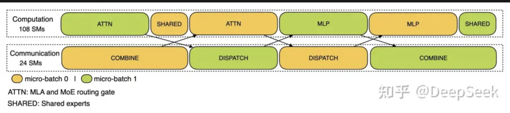
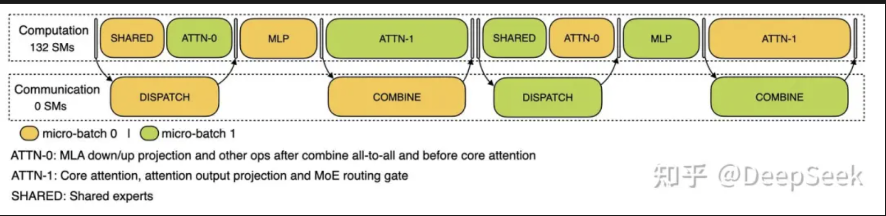
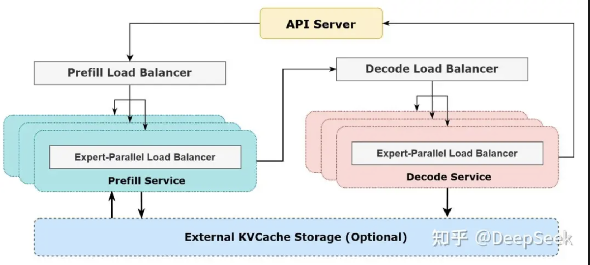

# DeepSeek 创新

## DeepSeek V3

### 模型架构创新优化

**混合专家（MoE）架构与智能激活策略**

- MoE 拥有 6710 亿参数，但每个 token 仅激活 370 亿参数
- MoE 采用动态冗余策略，在推理和训练过程中实现高效运行
- MoE 架构将模型分解为多个专家网络，每个专家处理特定输入子集，通过路由机制智能分配输入数据，降低计算成本

**多头潜在注意力机制（MLA）**

- 解决 kv-cache 对显存的压力
- 通过低秩压缩 key-value 矩阵，减少对内存占用并提升推理效率
- 通过稀疏注意力机制优化长序列处理，提升文本任务表现

**无辅助损失的负载均衡策略**

- 传统的 MoE 模型依赖辅助损失函数平衡负载，但是增加了训练复杂度且效果有限
- 通过动态路由偏置调整解决负载均衡问题，避免引入辅助损失函数，提高专家利用率和训练稳定性

**多 Token 预测技术（MTP）**

- 传统自回归语言模型每次仅预测一个 token，限制了长文本的生成表现
- MTP 技术每次推理预测多个 token，提高生成效率和连贯性，并结合投机算法加速推理

### 训练优化

**高效优化**

- V3 在 14.8 万亿高质量 tokens 上预训练，优化预训语料库，增加数学和编程样本比例，扩展多语言覆盖范围
- 开发 FP8 混合精度训练架构，突破跨节点 MoE 训练通信瓶颈，提升训练效率，降低成本

**知识蒸馏和性能提升**

- 后训练阶段引入知识蒸馏方法，将 DeepSeek R1 的推理能力转移到标准大语言模型中
- 通过生成高质量训练样本，整合 R1 的验证和反思机制，显著提升推理能力

**训练过程稳定性**

- 未出现不可恢复的损失峰值，无需回滚操作
- 稳定性得益于创新框架设计和优化策略

### 推理和部署优化

**预填充和解码分离**

- 采用预填充和解码分离策略：提升系统吞吐量，较少解码延时，优化资源利用
- 冗余专家部署和动态路由策略：推理阶段引入冗余专家部署，确保 GPU 处理平衡，同时探索动态冗余策略，优化推理效率

## DeepSeek R1

### 纯强化学习训练

- R1-Zero 版本无需 SFT 数据，仅通过强化学习实现推理能力自主进化，减少模型参数量，且将强化学习能力泛化到无明确奖励信号的领域

### 组相对策略优化算法（GRPO）
- 简化训练复杂度，提升效率，防止 reward hacking

### 多阶段训练策略

- 解决强化学习训练的问题，采用 "冷启动 + 多阶段 RL" 策略
- 冷启动阶段微调基础模型，规范输出格式
- 后续通过两阶段学习优化性能，包括推理导向 RL 和通用对齐 RL

### 长链推理技术

- 思维链长度可达数万字，通过多步骤逻辑推理解决问题，提升复杂任务效率

## 工程创新

**推理系统的优化目标是：更大的吞吐，更低的延迟？**

`
为了实现这两个目标，使用大规模跨节点专家并行（Expert Parallelism / EP）。首先 EP 使得 batch size 大大增加，从而提高 GPU 矩阵乘法的效率，提高吞吐。其次 EP 使得专家分散在不同的 GPU 上，每个 GPU 只需要计算很少的专家（因此更少的访存需求），从而降低延迟
`

但 EP 也增加了系统的复杂性：

- EP 引入跨节点的传输。为了优化吞吐，需要设计合适的计算流程使得传输和计算可以同步进行
- EP 涉及多个节点，因此天然需要 Data Parallelism (DP)，不同的 DP 之间需要负载均衡

*因此，如何使用 EP 增大 batch size，如何隐藏传输的耗时，如何进行负载均衡？*

### 大规模节点专家并行（Expert Parallelism / EP）

`
由于 DeepSeek-V3 / R1 的专家数量众多，并且每层 256 个专家中仅激活其中 8 个。模型的高度稀疏性要求采用很大的 overall batch size，才能给每个专家提供足够的 expert batch size，从而实现更大吞吐，更低延迟
`

**采用多机多卡间的并行策略：**

- Prefill: 路由专家 EP32、MLA 和共享专家 DP32，一个部署单元是 4 节点，32 个冗余路由专家，每张卡 9 个路由专家和 1 个共享专家
- Decode: 路由专家 EP144、MLA 和共享专家 DP144，一个部署单元是 18 节点，32 个冗余路由专家，每张卡 2 个路由专家和 1 个共享专家

### 计算通信重叠

`
多机多卡的专家会引入比较大的通信开销，所以使用了双 batch 重叠来掩盖通信开销，提高系统吞吐
`

**Prefill**

对于 prefill 阶段，两个 batch 的计算和通信交错进行，一个 batch 在进行计算的时候可以去掩盖另一个 batch 的通信开销

**Decode**

对于 decode 阶段，不同阶段的执行时间有所差别，把 attention 部分拆分成两个 stage，共计 5 个 stage 的流水线来实现计算和通信的重叠

### 尽可能地负载均衡

`
由于采用了很大规模的并行（包括数据并行和专家并行），如果某个 GPU 的计算或通信负载过重，将成为性能瓶颈，拖慢整个系统；同时其他 GPU 因为等待而空转，造成整体利用率下降
`

**Prefill Load Balancer**

- 核心问题：不同数据并行（DP）实例上的请求个数、长度不同，导致 core-attention 计算量、dispatch 发送量也不同
- 优化目标：各 GPU 的计算量尽量相同（core-attention 计算负载均衡）、输入的 token 数量尽量相同（dispatch 发送量负载均衡），避免部分 GPU 处理时间过长

**Decode Load Balancer**

- 核心问题：不同数据并行（DP）实例上的请求数量、长度不同，导致 core-attention 计算量（与 KVCache 占用量相关）、dispatch 发送量不同
- 优化目标：各 GPU 的 KVCache 占用量尽量相同（core-attention 计算负载均衡）、请求数量尽量相同（dispatch 发送量负载均衡）

**Expert-Parallel Load Balancer**

- 核心问题：对于给定的 MoE 模型，存在一些天然高负载专家（expert），导致不同 GPU 的专家计算负载不均衡
- 优化目标：每个 GPU 上的专家计算量均衡（即最小化所有 GPU 的 dispatch 接收量的最大值）

### 实际的线上系统

- 量化策略

`
DeepSeek V3 和 R1 的所有服务均使用 H800 GPU，使用和训练一致的精度，即矩阵计算和 dispatch 传输采用和训练一致的 FP8 格式，core-attention 计算和 combine 传输采用和训练一致的 BF16，最大程度保证了服务效果
`

- 资源动态调整

`
白天负载负荷高，晚上负荷低，因此在白天的时候，用所有节点部署推理服务。晚上负荷低的时候，减少推理节点，以用来做研究和训练
`

**Reference**

- [悟透 DeepSeek 创新](https://mp.weixin.qq.com/s/IliUhZOTwyvs2_rQV0Qe8Q)
- [DeepSeek 再次震惊全球：价格只有 OpenAI 1/25，利润率却超过 500%](https://mp.weixin.qq.com/s/FV4JSZ_8wVSfUyHGiqYaeQ)
- [profiling 数据的 batch 重叠细节](https://github.com/deepseek-ai/profile-data)
