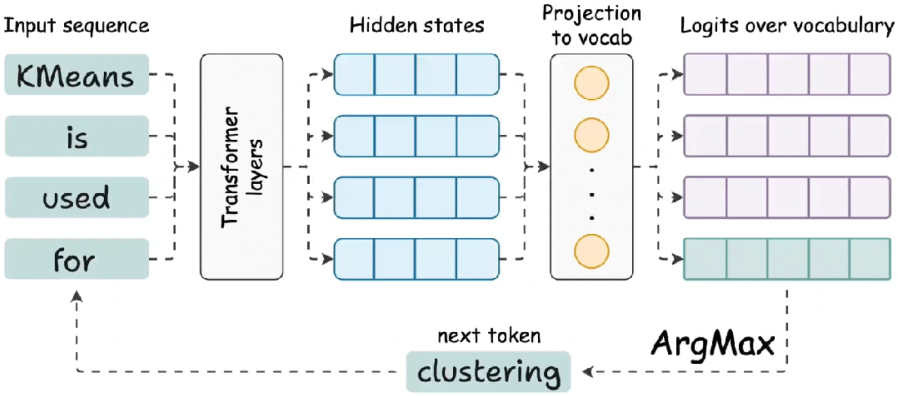
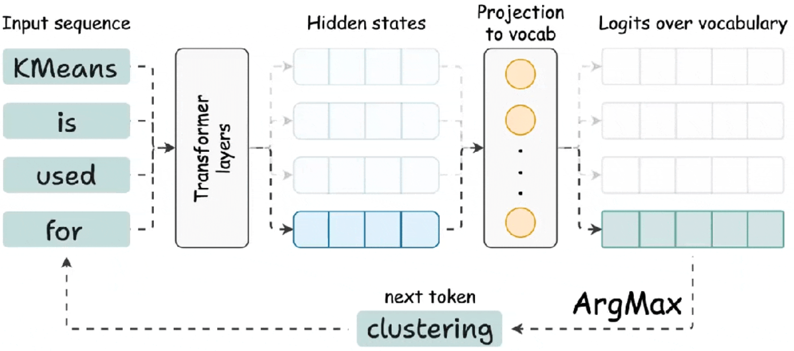
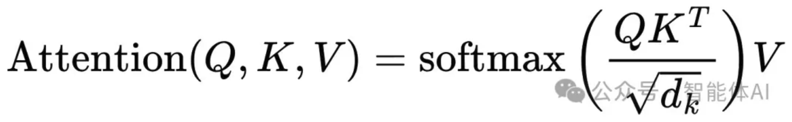
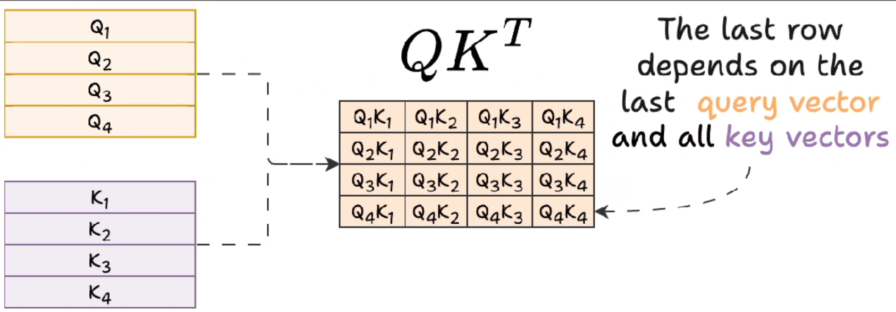

# KV Cache

```
和 DeepSeek 聊天时，第一个字总是比后面的字慢一些？这其实跟 KV Cache 有关。
```

## KV 缓存的重要性

- 使用 KV 缓存：生成一段文本只需 8 秒
- 不使用 KV 缓存：生成一段文本却花了 40 秒，慢了大约 4.5 倍

## LLM 如何输出 Token

*LLM 的核心是个 Transformer 模型，它的工作流程是这样的：*



- 生成隐藏状态：模型会为输入的所有 token 生成隐藏状态（hidden states），这些隐藏状态就像是 token 的 "语义身份证"
- 投影到词汇空间：这些隐藏状态会被映射到词汇表中，生成每个 token 的 logits（一种概率分布）
- 预测下一个 token：最后一个 token 的 logits 会被用来预测并生成下一个 token
- 循环往复：把新生的 token 加到输入中，重复以上步骤，逐步生成更多内容



**这里有个关键点：每次生成新 token 时，模型其实只关心最后一个 token 的隐藏状态，其他 token 的隐藏状态在这一步并不直接参与**

## 注意力机制中的计算

```
Transformer 的 "魔法" 离不开注意力机制（Attention Mechanism），它决定了每个 token 的隐藏状态是如何计算出来的
```



- 查询向量（Query）：代表当前 token 想 "问什么"
- 键向量（Key）：代表所有 token 的 "身份信息"
- 值向量（Value）：代表所有 token 的 "内容信息"

**注意力机制的运算过程：**



- 只需最后一个 token 的查询向量，去 "询问" 所有之前的键向量，算出他们之间的相关性
- 再用值向量加权求和，得出最后一个 token 的隐藏状态

*换句话说，每次生成新 token，只需要最后一个 token 的查询向量和所有 token 的键和值向量*

## KV 缓存的实现和优势

```
在生成新 token 时，模型需要为每个 token 计算键盘（Key）和值（Value） 向量，这些键和值向量在生成的过程中是固定不变的，这就是 KV Cache 的精髓
```

## KV 缓存的内存占用

*KV Cache 虽然提升了推理速度，但会显著增加显存占用*

### 模型参数解析

#### 结构参数

- 层数：32 层（Transformer 层总数）
- 隐藏层维度：4096（每层神经元数量）
- 注意力头数：32 头（典型配置，隐藏层 4096/头数32 = 每头维度 128）
- 数据类型：float16（行业通用配置，2 字节/参数）

#### KV Cache 计算

- 每层每个 token 存储 K、V 矩阵各一个
- 单头维度 128 -> 每头 K/V 向量长度 128
- 每 token 单层显存：32 头 * 128 维 * 2 (K + V) * 2 字节 = 16384 字节
- 32 层总内存：16 KB * 32 = 512 KB（0.5 MB）per token

### 显存占用分析

- 单词推理（4096 token 上下文）

`
4096 token * 0.5 MB/token = 2048MB = 2GB
`

- 兵法场景（100 用户）

`
100 * 2GB = 200 GB 显存
`

### 部署挑战

- 显存瓶颈：单卡 A100（80GB）仅支持约 40 用户并发
- 动态扩展：需结合显存卸载（Offloading）或分布推理
- 精度权衡：采用 int8 量化可降低 50% 内存，单需验证精度损失

### 优化方案

- 分组查询注意力（GQA）：减少 KV 头数，如 32 头 -> 8 组
- 窗口注意力：限制历史 token 缓存数量（如滑动床头 2048）
- 动态缓存：根据生成阶段调整缓存精度（首 token 用 fp 16，后续用 int8）


**References**

- [揭秘 DeepSeek 首字延迟之谜：大模型 KV Caching 背后的技术玄机](https://mp.weixin.qq.com/s/sEfItiazhoiq7yw2lN7HEQ)


