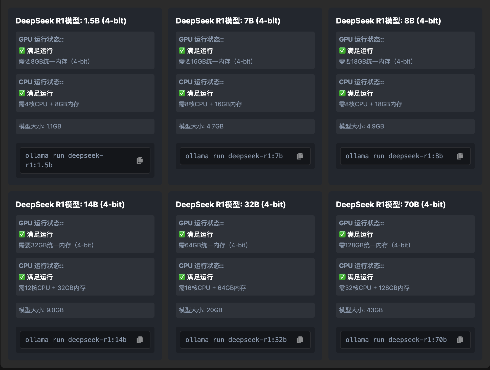

# DeepSeek Multi Version

## R1

### Multi Version

- 1.5B（15 亿参数）
- 7B（70 亿参数）
- 8B（80 亿参数）
- 14B（140 亿参数）
- 32B（320 亿参数）
- 70B（700 亿参数）
- 671B（6710 亿参数）

- 模型中每个参数占用 4 个字节（32 位）

**硬件要求：**

- 1.5B: 普通的四核或六核处理器即可
- 7B/8B: 适合大多数任务，性能较好且硬件要求适中

### 精度和内存转换

**显存：**

`
显存 ~~ 参数量 * 精度位数（Bytes） + 激活值占用
`

例如：7B 的 FP6 模型 ~~ 7B * 2 Bytes = 14 GB (未包含激活值)

**内存**

`
内存部署需预留 20% 冗余（如 7B FP6 建议 18GB + 显存）
`

**量化影响**

`
8-bit 量化显存占用减半，4-bit 再减半，但可能损失 1-3% 的精度
`

- Ollama 默认使用 4-bit 量化模型，显存占用为 FP16（16-bit 等于 2 bytes）的 1/4

**备注 mac (apple) 内存和显存计算**

- [mac apple memory](../pics/mac-apple-memory.png)

