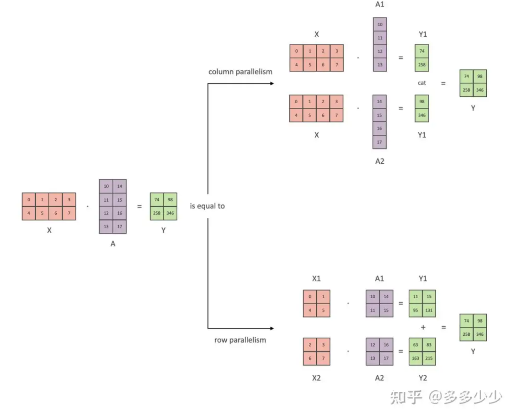

# Parallel

- Pipeline Parallel(PP): 将一个模型分成不同的 layer, 不同的 layer 在不同的 GPU 上
- Data Parallel(DP): 并行处理 dataloader 里面的 batch，分为 Distributed Data Parallel（DDP），DP，ZeRO（Zero Redundancy Optimizer）
- Tensor Parallel(TP): 把一个矩阵乘法分块计算

## MP (Native Model Parallelism)

### 前置条件

- 假设一个 GPT 模型存在 8 层 transformer layer
- 模型运行在两个 GPU 上（GPU 默认 id 从 0 开始，也就是 GPU0 和 GPU1）
- 把钱四个 layer 放在 GPU0 上，后面四个放在 GPU1 上

### 具体流程

- 以一个 batch 来分析，在一次 forward 的情况下，一个 batch 首先通过 0-3 层，进行正常的 forward 计算
- 此时 GPU1 是 idle 状态，然后输出结果给 GPU1 上的 4-7 层计算，此时 GPU0 是 idle 状态
- 最后算完后输出值到 layer0 计算 loss 或者传递 label 到 layer7 计算 loss


*这种方法基本和在单卡上跑没什么区别，甚至性能会因为 Data 在不同 gpu 上的传递导致 overhead*

## PP (Pipeline Parallel)

### 前置条件

- 将一个 batch 划分陈更小的 batch，这里叫 micro-batch，而划分多少，这个参数叫做 chunks

### 具体流程


- 这里有四个 GPU，模型被拆分成四块，每个 GPU 一块
- 其中 F 代表 forward，B 代表 backward
- GPU0 在处理第 0、1、2 和 3 个块（F0,0, F0,1 F0,2 F0,3）时执行相同的前向路径，然后等待其他 GPU 完成它们的工作
- 只有当其他 GPU 开始完成它们的工作时，GPU0 才会继续进行反向传播路径，顺序块为 3、2、1 和 0（B0,3 B0,2 B0,1 B0,0）
- 整个过程中有段空闲时间，就是 F3 和 B3，这是因为最后一个 forward 必须等待 backward 完成才能继续进行

**这样的优化，可以减少 idle 时间（bubble），这是 PP 的主要思路**

## DP

### 解决问题

```
DP 最初解决的问题是对于一个 dataloader，一般在一张卡训练一个模型。但是如果机器上有多张卡，我们希望以不同的 batch 同时进行迭代这个 dataloader 然后同时训练模型，当训练某个 epoch 完成后再同步 loss 更新模型
```

### DP 执行流程

- 首先是 GPU0 获取整个 batch 的数据然后把 mini batch 分发到其它的 GPU 上
- 然后当前模型从 GPU0 上复制到其他卡上
- 在 forward 后，其它卡的输出结果都 reduce 到 GPU0 上计算 loss
- 计算完成 loss 后再分发到其他 GPU 上分别计算梯度
- 计算完梯度后再 reduce 到 GPU0 上进行反向传播

### DDP (Distributed Data Parallel)


- 假设有四张卡，把模型复制四分，每个卡上放一份
- 然后以不同的遍历顺序并行获取 Dataloader 的 batch（其实是获取一大的 batch 然后拆分成 mini batch 分配）
- 当所有卡的模型 copy 都完成自己对应的 mini batch 的 forward 的时候，把每个卡的 loss 平均求和（这里可以用 accumulate grad 进行大 batch 训练）
- 使用 average grad 进行反向传播，然后更新模型

**DP Vs DDP**

- 在 DDP 里每个模对于 mini batch 的数据的 consume 是并行的

### ZeRO DP

```
使用 DP 或 DDP 都是希望并行 consume 数据集做到多卡并行计算，而使用 ZeRO DP 更希望解决的问题是一个卡放不下整个模型，而是只能方一个恶魔行的一部分（部分模型参数、权重、以及优化器的一部分）
```


- 假设有一个三层的 transformer layer 的模型
- 包含三组参数 a, b, c
- 把三层中的 a 参数（a0、a1、a2）放在 GPU0 上，b 放在 GPU1 上以此类推
- 以 mini batch0 为例，当开始 forward 的时候，也就是来到 layer0 在 GPU0 上进行处理
- 然后从 GPU1 和 GPU2 获取 b0 和 c0 然后进行计算
- 当完成第一层的计算后，来到第二层操作依旧类似

*通过把模型同一层的参数存储到不同的卡上，然后在 forward 计算的时候从其它 GPU 获取其它的参数*

## TP (Tensor Parallel)



- 基于朴素线性代数的优化，也就是线性代数里面的分块矩阵
- TF 有两种一种是 Column Parallel 另一种是 Row Parallel

```
在 transformer 的计算过程中，主要有 Q、K、V 的投影以及 Attention 计算的两个矩阵乘法可以把其中输入的 tensor X 以及权重都采用 TF 的方法来存储，依靠和上面类似的 gather 以及 reduce 的方法在不同的 GPU 只阿金传递所需要的数据，最后进行 concatenate 或者相加得到最后的结果，这样可以减少单卡的负载
```

## DP + PP


- 一共四张卡
- 设置两个 batch 数据，这里叫做 DP rank0 以及 DP rank1 的数据
- 然后其中模型可以放在两个卡上（采用 PP）

## DP + PP + TP


- 有 32 个 GPU，8 个 node（也就是 8 个节点服务，每个节点上插 4 张卡）
- 把一个模型通过 pp 分成四个部分
- 每个部分的权重通过 ZeRO 存储在不同卡上


**Reference**
- [理解 LLM infra 中的一些基本概念：PP、TP、DP、ZeRO](https://mp.weixin.qq.com/s/l480MpW8yXws1JL6tVzf4Q)


