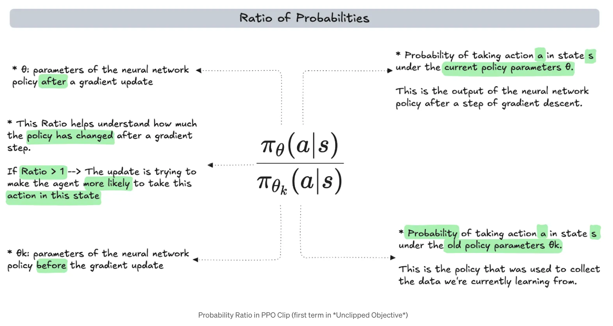
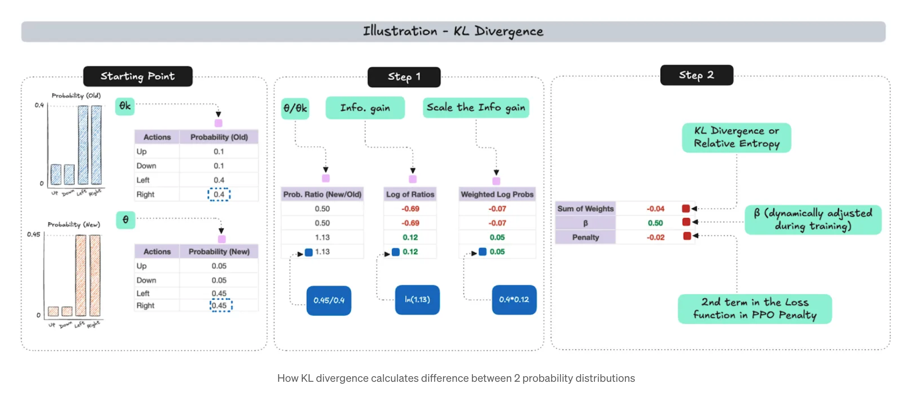
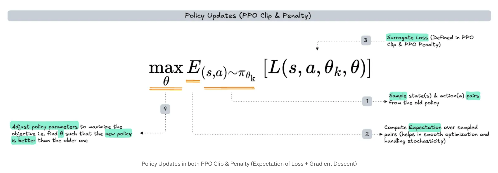

# PPO VS GRPO

## PPO

`
In 2017, researchers at Open AI released a paper that introduced a new family of policy methods for reinforcement learning called Proximal Policy Optimization (PPO). In a nutshell, PPO is motivated by the question: 'How can we take the biggest possible improvement step on a policy using the data we currently have, without stepping so far that we accidentally cause performance collapse.'
`

### RL Terminologies

| Term | Explanation |
| :----: | :----: | 
| Agent | The learner or decision-maker, like a robot or an AI program. It interacts with the environment and learns to achieve a goal |
| Environment | Everything outside the agent. It includes everything the agent interacts with, such as the physical world or a game |
| State | The current situation or condition of the environment. It provides information about where the agent is and what's happening around it |
| Action | A move or decision made by the agent that can affect the environment |
| Reward | Feedback from the environment, indicating how good or bad an action was in a given state. The agent's goal is to maximize cumulative rewards. |
| Policy | The agent's strategy for choosing actions in different states. I can ben deterministic (always choosing the same action in a given state) or stochastic (choosing actions with some probability) |
| Value Function | Estimates the long-term value of being in a particular state, considering future rewards |

### PPO Clip

`
PPO - Clip relies on specialize clipping in the objective function to remove incentives for the new policy to get far from the old policy. 
`

To begin with, PPO Clip takes a batch of data and calculates what's known as a Surrogate Loss. The surrogate loss is a minimum of 2 values - an unclipped objective and a clipped objective.

#### Proximal Policy Optimization (PPO) - Clip

#### Advantage in PPO Clip

**Probability Ration in PPO Clip**

`
The probability ratio in the unclipped objective term determines how likely the new policy is compared to the older one.

If the ratio exceeds 1, the new policy is more likely. Alternatively, if the ratio is less than 1, then the older policy is more likely.
`

#### Clipping

`
The goal behind clipping is to ensure that drastic policy updates do not take place. If the probability ratio is too high or too low, then it acts as an incentive for the new policy to get far from the old policy, which is undesirable. To prevent this incentive a hyper-parameter ε is used to limit the extent pf policy updates. 
`

### PPO Penalty

`
An alternative to the clipped surrogate objective in PPO Clip, or in addition to it,is to use a penalty on KL divergence. This approach is known as PPO - Penalty. A hyperparameter 𝛽 (penalty coefficient) scales the divergence value and is adapted so that we achieved some target value of the KL divergence each policy update.
`

#### KL Divergence in PPO - Penalty

KL Divergence is a statistical technique used to calculate the difference between 2 probability distributions

- First, take the ratio of new and old probabilities for each possible action.In the example, the ratio for action is 1.13
- Second, take a natural logarithm of these probabilities (also known as the information gain)
- Subsequently, we weighted the 'information gain' by the old probabilities.

### Policy Updates in PPO Clip and PPO Penalty

- PPO policy update is essentially taking an expectation of the loss over a batch of trajectories
- The policy then gets updated (new policy parameters θ) using stochastic gradient descent (SGD)

### PPO Formulation in LLMs

`
In the context of Large Language Models, the Reinforcement Learning (particularly PPO)  formulation is altered b bit. Instead of using (state, action) pairs, we use the notation ot | q,o<t where q,o are questions and outputs sampled from the question dataset.
`

- ot is the token generated at time step t based on the current question
- o<t are the tokens generated till before step t (i.e the partial output before t)

`
Outputs generated by the LLM can be seen as "actions" taken in response to an input question. Similarly, the question is analogous to the state - just as an agent;s action depends on the current state in traditional RL, the LLM's output depends on the current input question. 
`

**Additionally, we have a reward model that evaluates LLM outputs - this helps the model receive feedback and produce better results over time**

**Reference**

- [DeepSeek Math](https://arxiv.org/abs/2402.03300)
- [Understanding the Math Behind GRPO - DeepSeek-R1-Zero](https://medium.com/yugen-ai-technology-blog/understanding-the-math-behind-grpo-deepseek-r1-zero-9fb15e103a0a)