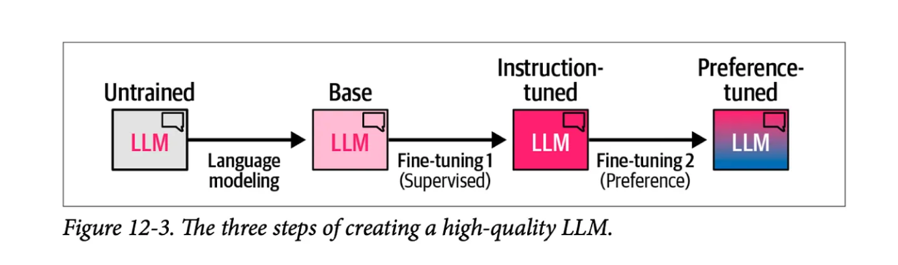
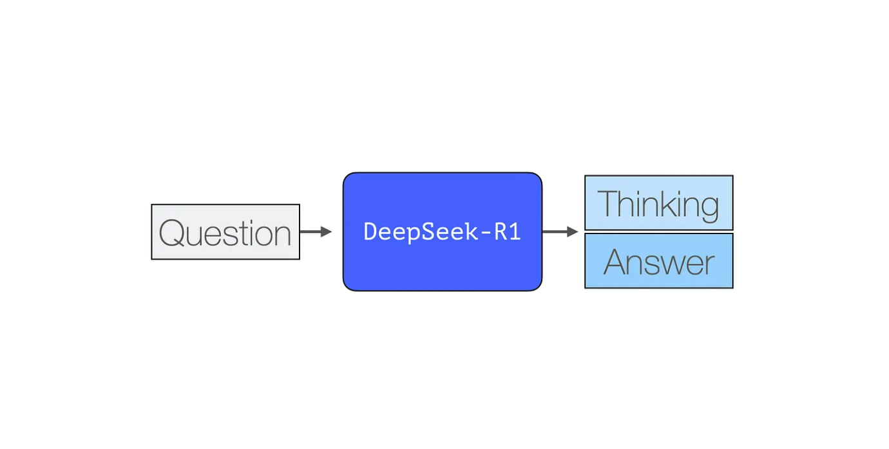
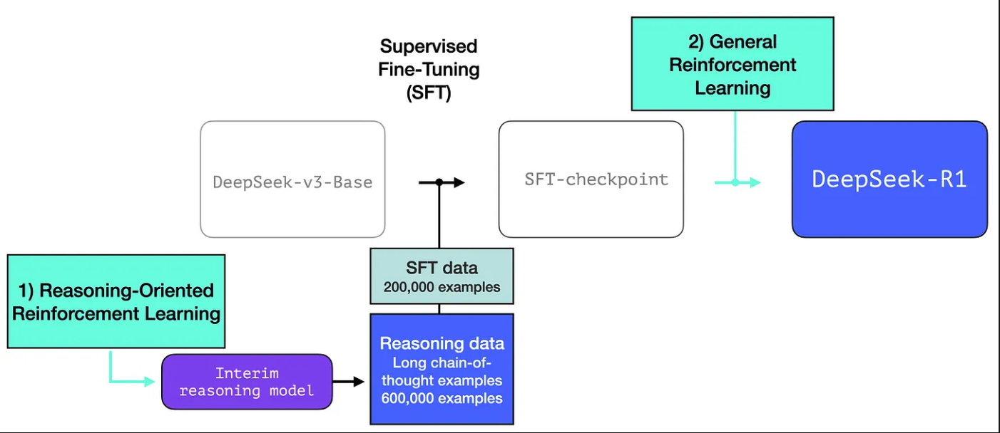
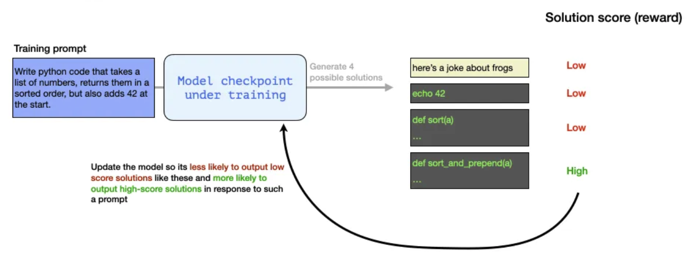
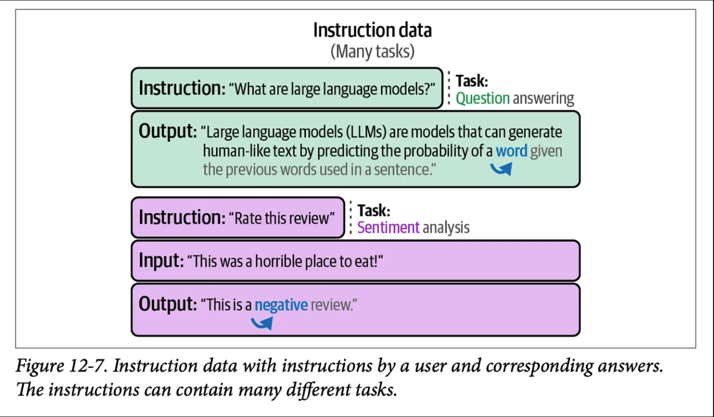
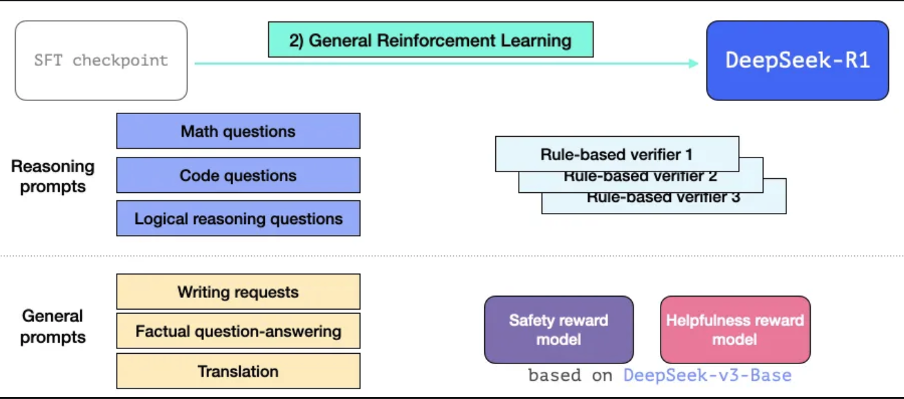
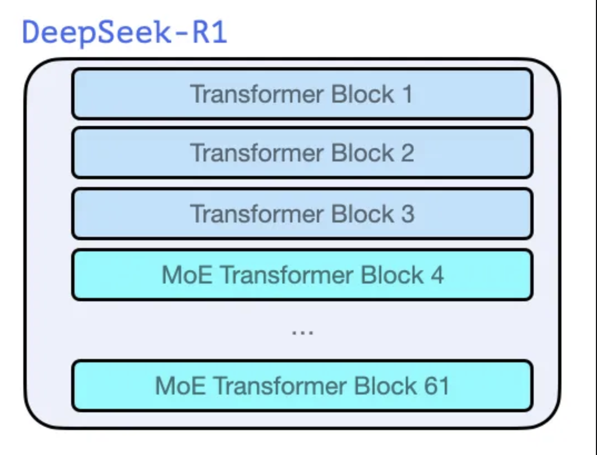
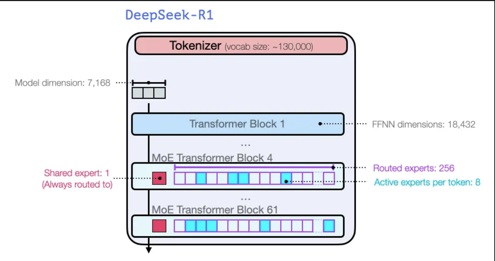

# DeepSeek

## DeepSeek-R1 Illustration

### How LLMs are trained

#### The gerneral recipe of creating a high-quality LLM over three steps?

- The language modeling step where we train the model to predict the next word using a massive amount of web data. This step results in a base model
- a supervised fine-tuning step that makes the model more useful in following instructions and answering questions
- a preference tuning step which further polishes its behavior and aligns to human preferences

#### DeepSeek-R1 Recap

`
DeepSeek-R1 generates one token at a time, except it excels at solving math and reasoning problems because it is able to spend more time  processing a problem through the process of generating thinking tokens that explain its chain of thought
`

### DeepSeek-R1 Traning Recipe

#### 1. Long chains of reasoning SFT data

`
This is a large number of long chain-of-thought examples (600,000 of them). These are very hard to come by and very expensive to label with humans at this scale.
`

#### 2. An interim high-quality reasoning LLM

`
It is significant not because it's a great LLM to use, but because it required so little labeled data alongside large-scale reinforcement learning resulting in a model that excels at solving reasoning problems.
`

`
The outputs of unnnamed speciallist reasining model can be used to train a model general model that can also do other, non-reasoning tasks, to the level users expect from a LLM.
`

#### 3. Creating reasoning models with large-scale refinforcement learning (RL)

##### 3.1 Large-Scale Ressoning-Oriented Reinforcement Learning（R1-Zero）

- RL is used to create the interim reasoning model
- This model is then used to generate the SFT reasoning examples
- DeepSeek-R1-Zero is used to create the interim model
- R1-Zero is special because it is able to excel at reasioning tasks without having a labeled SFT training set (Its training goes dirctly from a pre-trained base model through a RL training peocess, not SFT step)

**Data has always been the fuel for ML mode capability, How can this model depart from this history?**

- Modern base model have crossed a certain threadhold of quality and capability (this base model was trained on 14.8 trillion high-quality tokens)
- Reasoning problems, in contrast to general chat or writing requests, can be automatically verified or labeled

**Example: Automatic Verification of a Reasioning Problem**

`
Write python code that takes a list of numbers, returns them in a sorted order, but also adds 42 at the start.
`

A question like this lends itself to many ways of automatic verifaction.

- A software linter can check if the completion is proper python code or not
- Executing the python code to see if it even runs
- Other modern coding LLMs can create unit tests to verify the desired behavior 
- Measuring execution time and making the training process perfer more performant solution over other solutions - even if they're correct python programs that solve the issue

**Example：**

We can automatically check (with no human intervention)

- The first completion is not even code
- The second one is code, but is not python code
- The third is a possible solution, but fails the unit tests
- The forth is a correct solution

These are all signals that can directly used to improve the model. This is of course done over many examples (in mini-batches) and over successive training steps.

**DeepSeek-R1-Zero Issue:**

`
DeepSeek-R1-Zero struggles with challenges like poor readability, and language mixing.
`

**DeepSeek-R1-Zero Usages:**

- creating an interim reasoning model to generate SFT data points
- Training the R1 model to improve on reasoning and non-reasoning problems (using other types of verifiers)

#### 3.2 Creating SFT reasoning data with the interim reasioning model

To make the interim reasoning model more useful, it goes through an supervised fine-tunning (SFT) training step on a few thousand examples of reasoning problems (some of which are generated and filtered from R1-Zero).

`
To prevent the early unstable code start phase of RL training from the base model, for DeekSeek-R1 we construct and collect a small amount of long CoT data to fine-tune the model as the initial RL actor.

To collect such data, we have explored several approaches: using few-shot prompting with a long CoT as an example, directly prompting models to generate detailed answers with reflection and verification, gathering DeepSeek-R1-Zero outputs in a readable format, and fefining the results through post-processing by human annotators.
`

`
If you're new to the concept of Supervised Fine-Tuuning (SFT), that is the process that presents the mode with training examples in the form of prompt and correct completion.
`

#### 3.3 General RL training phase

`
This enable R1 to excel at reasoning as well as other non-reasioning tasks. 
`

### Architecture

DeepSeek-R1 is a stack of Transformer decoder blocks, It's made up 61 of them. The first three are dense, but the rest are mixture-of-experts layer.

In terms of model dimension size and other hyperparameters, they look like this:

**Reference**

-[图解 DeepSeek-R1](https://zhuanlan.zhihu.com/p/21175143007)
- [The Illustrated DeepSeek-R1](https://substack.com/home/post/p-155812052)
- [DeepSeek-V3 Techical Report](https://arxiv.org/pdf/2412.19437v1)
- [DeepSeekMoE: Towards Ultimate Expert Speciallization in Mixture-of-Experts Language Models](https://arxiv.org/pdf/2401.06066)
- [gotta better illustration of r1](https://x.com/himanshustwts/status/1885046490395029569?s=46&t=ulYQEDJ7GQSP3RJjsg3CJw)