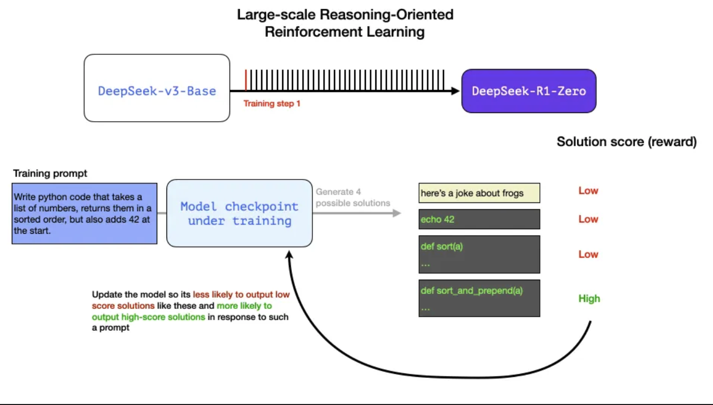

# DeepSeek

## DeepSeek-R1 Illustration

### How LLMs are trained

#### The gerneral recipe of creating a high-quality LLM over three steps?

- The language modeling step where we train the model to predict the next word using a massive amount of web data. This step results in a base model
- a supervised fine-tuning step that makes the model more useful in following instructions and answering questions
- a preference tuning step which further polishes its behavior and aligns to human preferences

#### DeepSeek-R1 Recap

`
DeepSeek-R1 generates one token at a time, except it excels at solving math and reasoning problems because it is able to spend more time  processing a problem through the process of generating thinking tokens that explain its chain of thought
`

### DeepSeek-R1 Traning Recipe

#### 1. Long chains of reasoning SFT data

`
This is a large number of long chain-of-thought examples (600,000 of them). These are very hard to come by and very expensive to label with humans at this scale.
`

#### 2. An interim high-quality reasoning LLM

`
It is significant not because it's a great LLM to use, but because it required so little labeled data alongside large-scale reinforcement learning resulting in a model that excels at solving reasoning problems.
`

`
The outputs of unnnamed speciallist reasining model can be used to train a model general model that can also do other, non-reasoning tasks, to the level users expect from a LLM.
`

#### 3. Creating reasoning models with large-scale refinforcement learning (RL)

##### 3.1 Large-Scale Ressoning-Oriented Reinforcement Learning（R1-Zero）

- RL is used to create the interim reasoning model
- This model is then used to generate the SFT reasoning examples
- DeepSeek-R1-Zero is used to create the interim model
- R1-Zero is special because it is able to excel at reasioning tasks without having a labeled SFT training set (Its training goes dirctly from a pre-trained base model through a RL training peocess, not SFT step)

**Data has always been the fuel for ML mode capability, How can this model depart from this history?**

- Modern base model have crossed a certain threadhold of quality and capability (this base model was trained on 14.8 trillion high-quality tokens)
- Reasoning problems, in contrast to general chat or writing requests, can be automatically verified or labeled

**Example: Automatic Verification of a Reasioning Problem**

`
Write python code that takes a list of numbers, returns them in a sorted order, but also adds 42 at the start.
`

A question like this lends itself to many ways of automatic verifaction.

- A software linter can check if the completion is proper python code or not
- Executing the python code to see if it even runs
- Other modern coding LLMs can create unit tests to verify the desired behavior 
- Measuring execution time and making the training process perfer more performant solution over other solutions - even if they're correct python programs that solve the issue

**Reference**

-[图解 DeepSeek-R1](https://zhuanlan.zhihu.com/p/21175143007)