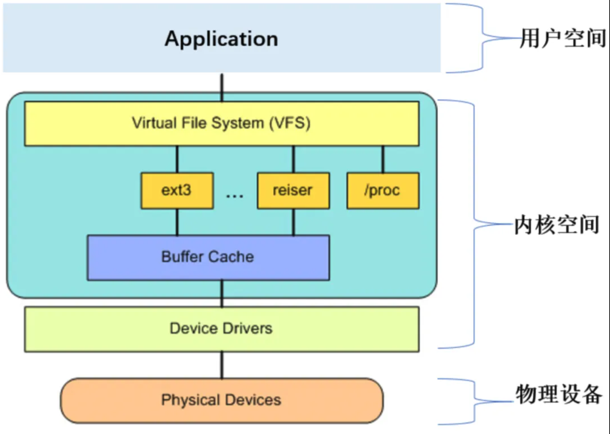
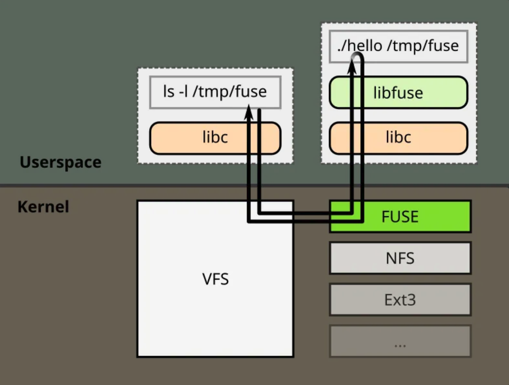
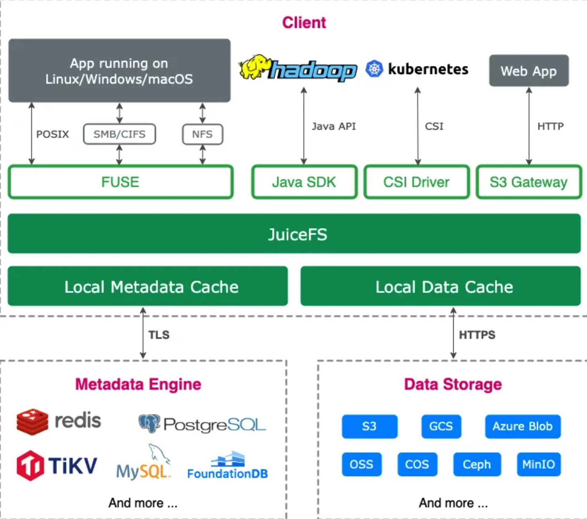

# FUSE

```
FUSE (Filesystem in Userspace) 是一个允许用户在用户态创建自定义文件系统的接口，诞生于 2001 年。FUSE 的出现大大降低了文件系统的开发的门槛，使得开发者能够在不修改内核代码的情况下实现创新的文件系统功能。
```

## 单机文件系统：内核态与 VFS

```
内核是拥有超级权限的代码，负责管理计算机的核心资源（如 CPU、内存、硬盘、网络等）。当内核代码运行时，程序进入内核态，可以完全访问和操作这些底层设备。由于内核态权限极高，其代码必须经过严格测试和验证，普通用户无法随意修改
```

```
用户空间是指操作系统提供给用户的部分，用户可以在用户空间中运行应用程序。在用户空间里，程序的权限是受到严格限制的，不能直接访问底层的重要资源
```



- 内核通过 VFS（virtual file system）封装了一套通用的虚拟文件系统接口，向上以系统调用的形式暴露给用户态，向下给底层的文件系统规定编程接口
- 底层文件系统需要按照 VFS 的格式开实现自己的文件系统接口
- 用户态访问底层文件系统的标准流程一般是 系统调用 -> VFS -> 底层文件系统 -> 物理设备

## 网络文件系统 NFS: 首次突破内核态

```
如果有一个需求是希望本地计算机能够访问远端的数据，那么可以将远端计算的一个子目录通过网络接口虚拟出来，并挂载到本地计算机的一个节点上。在这个过程中，应用程序无需做任何修改，仍然通过标准的文件系统接口就可以访问这些路径，就像访问这些节点上的本地数据一样
```

- 传统的文件系统通常是整个体系都运行在单机的内核态，而 NFS 首次打破这一限制

```
当应用程序对这些网络路径进行操作（如逐级目录查找）时，这些操作会被转化为网络请求，以 RPC（远程调用）的形式发送到远端计算机上执行。远程计算机在接收到这些请求后，会进行相应的操作（如查找文件、读取数据等），并将结果返回给本地计算机
```

- 传统的文件系统通常是整个体系都运行在单机的内核态，而 NFS 首次打破这一限制，服务端的实现结合了内核态与用户态

## FUSE: 从内核到用户态的文件系统创新

```
随着计算机技术的不断发展，许多新兴业务场景需要使用自定义文件系统。传统的内核态文件系统存实现难度高和版本兼容性问题。基于此，有人剔除一个构想：是否可以将 NFS 网络协议移植打到单机端，将服务端功能转移到用户态进程，用系统调用代替网络通讯，从而实现文件系统功能？（这一想法最终催生了 FUSE（filesystem in userspace）的诞生）
```

- 其内核模块作为操作系统内核的一部分，负责与 VFS 交互，将来自 VFS 的文件系统请求转发到用户态，并将用户态的处理结果返回给 VFS



- FUSE 的用户态库（libfuse）提供了与 FUSE 内核模块交互的 API 库，可以帮助用户实现一个运行在用户空间的守护进程（daemon）。守护进程负责处理来自内核的文件系统请求，并实现具体的文件系统逻辑

## JuiceFS：FUSE 用户态分布式文件系统

- 作为一款基于对象存储的分布式文件系统，选择采用 FUSE 技术来构建其文件系统的架构，以 FUSE 灵活的扩展性开应对云计算环境中的多样性需求
- 通过 FUSE 技术，JuiceFS 文件系统能能够以 POSIX 兼容的方式挂载到服务器，将海量云端存储直接当做本地存储来使用，常见的文件系统指令（如 ls、cp 等）都可以用来管理 JuiceFS 中的文件和目录




**Reference**
- [FUSE, 从内核到用户态文件系统的设计之路](https://mp.weixin.qq.com/s/5e1qePlAL0kdaIJo5FR4hw)