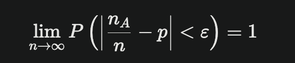
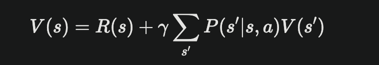
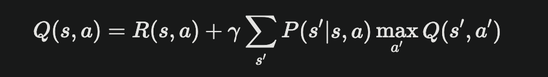
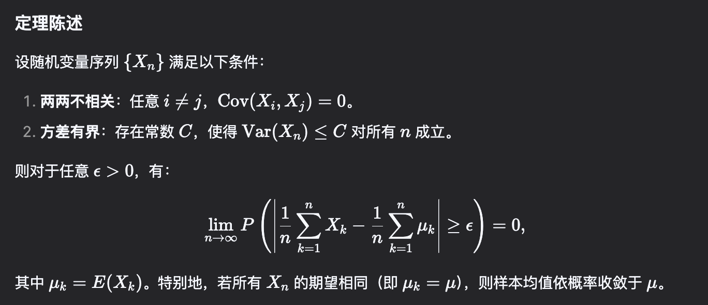

# Mathematic

## 低秩矩阵

### 什么是低秩矩阵

`
低秩举证是指秩（rank）远小于其行数和列数的矩阵，具体的说，如果一个矩阵 X 的秩 rank(X) 远小于其行数 m 和列数 n，则称为低秩矩阵。低秩矩阵的每一行或每一列都可以用其他行或列的线性组合来表示，意味着它包含大量冗余信息。
`

### 应用场景

#### 图像处理

- 图像去噪：通过低秩矩阵恢复技术，从含有噪音的图像中提取出清晰的图像。例如，利用低秩性质去除图像中的背景噪音。
- 图像压缩：将高维图像数据转换为低维特征，从而实现有效压缩，减少存储空间和传输带宽

#### 推荐系统

- 矩阵填补：在用户 - 物品评分矩阵中，许多评分可能缺失。通过低秩分解，预测缺失值，从而优化推荐系统。例如：通过分析用户历史评分来填补未评分电影的预测分数。

#### 信号处理

- 信号恢复：在信号处理中，低秩矩阵用于从部分观测数据中恢复完整信号，特别是在处理稀疏信号时表现出色

#### 计算机视觉

- 三维建模：在计算机视觉中，通过低秩矩阵来重建三维场景，利用图像序列中的冗余信息来提高重建精度

#### 高维数据分析

- 异常检测：在高维数据集中，低秩矩阵可以帮忙识别异常点或异常模式，通过分析数据的低秩结构来发现不寻常的行为或特征

## 伯努利大数定理

`
伯努利大数定理是概率论中的一个重要定理，主要描述了在重复独立试验中，事件发生的频率趋近于其理论概率的现象
`

### 定义

设在 n 次独立的伯努利试验中，某事件 A 发生的次数为 nA，而事件 A 在每次试验中发生的概率为 p。则对于任意整数 ε > 0, 有：

这意味着，随着试验次数 n 的增加，事件 A 发生的概率 nA/n 将几乎必然地接近于其理论概率 p

### 理论背景

- 核心思想是频率的稳定性，为概率论提供了严谨的数学基础，使得在大量实验中观察到的相对频率可以用来估计真实的概率

## MC (蒙特卡洛学习法)

### 定义

蒙特卡洛学习法是一种基于随机采样的强化学习算法，通过与环境交互来学习最优策略。它通过多次随机采样来估计状态 - 动作对的价值函数，从而找到最优策略

### 工作原理

#### 过程

- 状态选择：智能体在环境中选择一个初始状态
- 动作执行：根据当前策略选择动作，并进入新的状态
- 回合结束：重复上述步骤，直到达到最终状态
- 回报计算：从最终状态向前回溯，计算每个状态的回报值（G 值）
- 价值估计：多次重复实验后，计算每个状态的 G 值平均值，以此来估算该状态的价值（V 值）

#### 理论基础

蒙特卡洛方法依赖于几个重要的统计理论，如伯努利大数定理和切比雪夫大数定理，这些理论确保随着实验次数的增加，样本平均值会收到收敛到真实期望值

### 应用场景

- 策略评估：通过多次试验来评估当前策略的表现
- 策略改进：基于评估结果更新策略，以提高未来的表现
- 无模型学习：不需要对环境动态的先验知识，仅通过经验进行学习

## 贝尔曼方程（Bellman Equation）

`
是强化学习和动态规划中的一个核心概念，描述了当前状态的价值与未来状态的价值之间的关系。

该方程由美国数学家查德 - 贝尔曼提出，广泛应用于马尔可夫决策过程（MDP）的求解
`

### 方程形式

**状态值函数的贝尔曼方程**

- V(s) 表示在状态 s 下的价值
- R(s) 表示在状态 s 下获得的即时奖励
- γ 表示折扣因子，用于权衡当前和未来的奖励
- P(s'|s,a) 表示在状态 s 下采取动作 a 转移到状态 s' 的概率

**动作值函数的贝尔曼方程**

- Q(s,a) 表示在状态 s 下采取动作 a 后的价值
- R(s,a) 表示在状态 s 下采取动作 a 后获得的即时奖励
- γ 表示折扣因子，用于权衡当前和未来的奖励
- P(s'|s,a) 表示在状态 s 下采取动作 a 转移到状态 s' 的概率

### 贝尔曼方程的作用

- 决策优化：为强化学习算法提供更新规则，使得智能体能够通过迭代更新状态或动作价值，从而找到最优策略
- 动态规划基础：允许通过递归方式计算最优值函数和最优策略
- 减少计算复杂度：通过利用当前状态信息，显著减少了求解最优策略时所需的计算复杂度，使得处理复杂决策问题变得更加可行
- 广泛应用：在众多强化学习算法中得道到应用，如 Q 学习，深度 Q 网络（DQN）等，未解决实际问题（机器人控制）提供了理论基础

## 切比雪夫大数定理

`
切比雪夫大数定理是概率论中的一个重要定理，它利用切比雪夫不等式和方差的性质，证明了在特定条件下样本均值收敛于期望均值
`

### 定义

