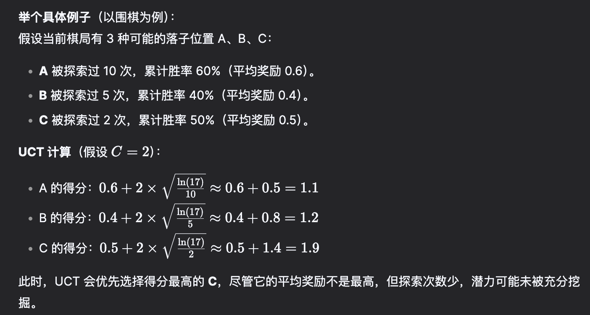
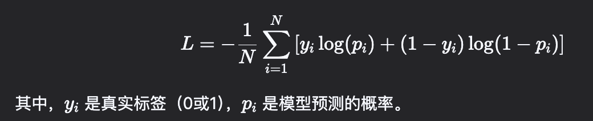
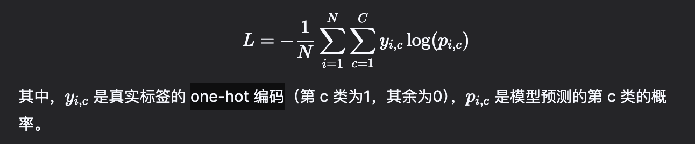
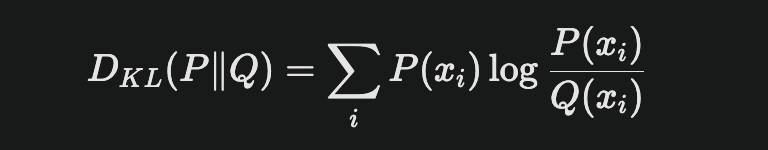

# Noun Explanation

## Bert

**Bidirectional Encoder Representations from Transformers**

### 框架

- 基于 Transformer 编码器部分
- 采用双向编码方式（能够同时考虑上下文的前后信息，从而生成更丰富的词表示）
- 能够同时考虑上下文的前后信息，从而生成更丰富的词表示

### 训练方式

- 主要用于掩码语言模型（masked Language Model, MLM）和下一句的预测（Next Sentence Prediction, NSP）作为训练任务
- MLM 通过随机掩盖输入序列中的一些词来训练模型，从而预测被掩盖的词
- BSP 用于判断两个句子是否连续

### 上下文的理解能力

- 双向特性，在理解整个句子或段落时表现出色，适合需要深入理解文本内容的任务，如情感分析、命名实体识别等

### 应用领域

- 广泛应用于分类、问答系统和句子关系判断等任务

## Gpt

**Generative Pre-trained Transformer**

### 框架

- 基于 Transformer 的解码器部分
- 采用自回归模型（从左到右生成文本，只能依赖于已生成的上下文来预测下一个词）

### 训练方式

- Gpt 使用自回归模型进行训练，专注于预测序列中的下一个词
- 通过在大规模无监督语料上进行训练，逐步生成文本

### 上下文的理解能力

- Gpt 作为单向模型，在生成文本时只能依赖已生成的文本，在处理需要全面理解的任务时可能表现不足
- 文本生成能力较强，适用于对话生成和内容创作等场景

### 应用领域

- 文本生成、机器翻译和对话系统

## BPE

**Byte Pair Encoding**

### 框架

- 一种基于统计的分词算法，最初用于数据压缩
- 通过迭代地合并最频繁的字符对来构建词汇表，减少词汇表的大小
- 减少词汇表大小，保持较高的词汇覆盖率，提高了模型的泛化能力

### 训练方式
- 初始化：将文本中的每个单词分解为字符序列
- 迭代合并：统计所有字符对的频率，选择出频率最高的字符对进行合并
- 跟新词汇表：重复合并过程，直到达到预订的词汇表大小或不再有频繁的字符对

### 应用领域

- 广泛应用于自然语言处理的任务中，如机器翻译、文本生成和语言模型训练

## SFT

**Supervised Fine-Tuning**
- 一种在深度学习和自然语言处理领域中常用的技术
- 通过对预训练模型进行进一步的训练，以提高模型在特定任务上的表现
- 主要用于在预训练模型的基础上，通过有监督的标注数据进一步调整模型参数，使其适应特定任务或领域的需求

### SFT 是什么

- 定义：SFT 是模型预训练的第二阶段（预训练 -> 微调 -> 其它优化）
- 输入数据：使用高质量的标注数据（如问答对、指令-回复对、任务示例），通常由人工标注或经过筛选生成
- 目标：调整预训练模型的参数，使其输出更符合特定任务的要求（如：对话、摘要、分类等）

### SFT 在大模型训练中的作用

#### 任务适配性提升

- 预训练模型（如 GPT、LLaMA） 通过海量无监督数据学习通用语言模型，但缺乏对具体任务的针对性
- SFT 通过标注数据教会模型如何遵循特定指令或格式（如代码生成、回答问题、客服对话），显著提升任务表现

#### 控制输出风格和质量

- 调整输出风格：例如让模型生成更正式、简洁或口语化的内容
- 减少有害/偏见输出：通过标注数据引导模型规避错误、偏见或不安全的内容

#### 解决预训练模型的局限性

- 预训练模型可能对低频任务（如专业领域术语）表现不佳，SFT 通过针对性数据增强其能力
- 修正预训练中未对齐的人类偏好或任务需求的行为（如冗余回复、答非所问）

### SFT 的典型流程

- 预训练模型：使用无监督数据（如互联网文本）训练基础模型（如 GPT-3）
- 构建监督数据集：收集任务相关的标注数据（如人工编写的问答对、指令回复对）
- 微调训练：在标注数据继续训练，调整模型参数（通常学习率较低、避免覆盖预训练的知识）
- 评估和迭代：验证模型在目标任务上的表现，调整数据和训练策略

### 示例应用场景

- 对话系统：用用户-助手对话数据微调，使模型生成更自然的交互回复
- 代码生成：用代码注释-代码对数据训练模型生成符合需求的代码片段
- 内容安全：通过标注的 "安全回复" 数据减少模型的有害输出

## RLHF

**Reinforcement Learning from Human Feeback 基于人类反馈的强化学习** 

### 定义

- 定义：RLHF 是一种结合强化学习和人类反馈的学习方法，通过人类对模型输出的评分或排序，训练模型生成更符合期望的文本
- 适用阶段：通常在大模型完成 预训练（Pretraing）和 监督微调（SFT） 之后使用，属于对齐（Alignment） 阶段的核心技术
- 核心思想：人类无法直接标注所有可能的输出，但可以通过对少量样本的反馈（好坏排序）训练一个奖励模型（Reward Model），再使用该模型代替人类指导强化学习

### RLHF 在 LLM 中的作用

#### 对齐人类偏好（Alignment）

- 问题：预训练或 SFT 后的模型可能生成不友好、有害或偏离用户意图的内容
- RLHF方案： 通过人类反馈定义 "好输出" 的标准（如安全性、有用性、真实性），训练模型对齐这些标准
- 示例：让模型避免生成歧视性言论或虚假信息

#### 提升生成内容的质量

- 优化主观性指标：如流畅性、逻辑性、创造性等难以通过监督学习直接优化的目标
- 示例：让模型生成更生动有趣的故事，或更符合特定场景的对话回复

#### 解决 SFT 的局限性

- SFT 依赖高质量的标注数据，但标注成本高且难以覆盖所有场景
- RLHF 通过少量反馈数据泛化到更广泛的情况，且能处理模糊或多目标的任务（如："既要简洁又要全面"）

#### 控制输出的安全与伦理

- 通过人类反馈明确禁止模型生成暴力、违法或违背道德的内容
- 示例：ChatGPT 通过 RLHF 大幅减少有害回复的概率

#### 数据高效性

- 相比需要海量标注数据的监督学习，RLHF 只需人类多少量输出进行评分或排序，即可训练奖励模型指导优化

### RLHF 的工作流程

**预训练 & SFT**

- 使用无监督数据训练基础模型（如 GPT-3），再通过监督微调（SFT） 初步对齐任务需求

**收集人类反馈**

- 让人类标注员对模型生成的多个输出进行评分或排序（如对同一个问题生成 4 个答案，标注员按照质量排序）

**训练奖励模型**

- 用人类反馈数据训练一个 "奖励模型"，使其能够预测人类对任意输出的偏好程度

**强化学习微调（PRO 算法）**

- 将预训练模型作为策略，奖励模型作为环境，使用强化学习算法（PRO） 优化模型，最大化累积奖励
- 关键点：需约束模型不要过度偏离原始预训练分布（防止 "奖励黑客" 或市区通用性）

### RLHF 的示例应用

- ChatGPT: 通过 RLHF 大幅提升对话的友好性、安全性和实用性
- Claude: 利用 RLHF 避免模型生成政治敏感或偏激的内容
- GPT-4: 结合 RLHF 优化复杂任务（如代码生成、多轮推理）的输出质量

## SFT Vs RLHF

### 核心目标

| SFT | RLHF | 
| :----: | :----: |
| 让模型学会执行特定任务（如问答、翻译）通过标注数据明确 "正确的输出"是什么 | 让模型对齐人类偏好（如安全性、有用性），通过反馈优化"主观质量" 或复杂目标（如 "简洁且全面"） |
| 示例：教模型按格式生成代码 | 示例：让模型避免生成有害内容，或生成更自然的对话回复 |

### 数据使用方式不同

| SFT | RLHF | 
| :----: | :----: |
| 依赖高质量标注的输入-输出对（如问题-答案、指令-回复） | 依赖人类对模型输出的反馈（如对多个输出的排序、评分或偏好标注） |
| 数据特点：明确、具体、任务相关 | 数据特点：主观、抽象、反映人类偏好 |
| 数据量：通常需要大量标注数据 | 数据量：反馈数据量较少，但需要覆盖多样性场景 |

### 训练方式不同

| SFT | RLHF | 
| :----: | :----: |
| 使用监督学习（Supervised Learning），直接通过交叉熵损失优化模型输出与标注答案的一致性 | 使用强化学习（Reinforcement Leaning），通过奖励模型（Reward Model）间接优化模型输出 |
| 训练方式：单阶段，直接调整模型参数 | 训练方式：多阶段（需要先训练奖励模型，再优化策略模型） |
| 优化目标：最小化预测误差 | 优化目标：最大化累积奖励（人类偏好得分） |

### 适用场景差异

| SFT | RLHF | 
| :----: | :----: |
| 任务明确，输出标准清晰：如分类、翻译、结构化生成 | 任务复杂，目标主观或需多目标平衡：如对话安全性、创造性写作、伦理对齐 |
| 示例场景：生成符合格式的 JSON 数据 | 示例场景：避免生成政治敏感内容 |

## PPO

**Proximal Policy Optimization（近端策略优化）**

- 是强化学习 （Reinforcement Learning）中一种广泛使用的策略优化算法
- 核心目标：是让智能体（Agent） 在复杂环境中稳定高效地学习策略，同时避免传统方法中训练不稳定的问题

### PPO 是什么？

- 策略梯度方法 (Policy Gradient) 的改进版本，由于 OpenAI 在 2017 年提出。通过限制策略更新的幅度（即 "近端" 约束），确保每次更新不会偏离当前策略太远，从而提升训练的稳定性

## GRPO 

**Group Relative Policy Optimization**

- 通过组内相对奖励来优化模型的策略，而不依赖传统的批评模型（critic model）

### GRPO 的核心原理

#### 相对奖励机制

- 通过从当前策略中采样一组输出，并计算这些输出的相对表现来进行优化
- 避免对每个输出进行单独评估的复杂性，简化了训练过程

#### 工作流程

- 输出采样：对于每个任务，GRPO 生成多个可能的答案或推理步骤
- 奖励计算：对这些输出进行评分，计算每个输出的奖励，并根据相对表现确定其优势
- 策略优化：根据相对优势调整策略，使得表现比较好的输出更有可能被生成，而表现比较差的输出被抑制

#### 优势和特点

- 简化训练：由于不需要评判模型，GRPO 显著降低了计算成本和复杂度
- 高效优化：通过组内相对奖励，GRPO 能够在复杂任务中提高模型性能

### 在 LLM 中的应用

`
GRPO 特别适合用于推理任务，如数学推理和代码生成等。在这些任务中，模型需要在多个步骤中逐步生成答案，GRPO 通过优化这些步骤的生成策略，提高了模型在推理过程中的准确性和效率
`

## MoE

**Mixture of Experts**

- 一种先进的神经网络架构
- 通过将多个专门化的子模型（即"专家"）组合在一起，以提高模型的效率和性能

### 核心概念

- 专家（Experts）：每个专家是一个独立的子网络，专注于特定类型的任务和数据处理；例如：在自然语言处理任务中，一个专家可能专注于语法分析，另一个专注于情感分析
- 门控系统（Gating Network）：该组件负责根据输入数据动态选择哪些专家参与处理，这种选择机制使得只有少数专家被激活，从而提高计算效率
- 稀疏激活（Sparse Activation）：在每次计算中，只有一小部分专家被激活，这降低了每次推理所需的计算负载，使得模型能够在较低的资源消耗下处理复杂任务

## RoPE

**Rotary Position Embedding（旋转位置编码）**

- 一种基于 Transformer 模型的位置编码方法
- 将位置信息有效集成到自注意力机制中，以提升模型性能

### 核心原理

- 位置信息编码：通过将位置信息编码为旋转向量，将其与词嵌入向量相加，从而增强模型对位置信息的理解
- 旋转角度计算：根据位置信息计算旋转角度，使得不同位置的词嵌入向量在不同角度上有差异

### 作用

- 集成相对位置信息：能够将显式的相对位置依赖性无缝集成到自注意机制中，使得模型在处理序列时能够更好地捕捉到 token 之间的关系
- 良好的外推性：与传统的绝对位置编码不同，RoPE 允许在推理时处理超过训练长度的输入
- 降低计算复杂度：与线性注意力机制兼容，使得在处理长文本时，计算复杂度 
- 增强模型性能：通过结合绝对和相对位置编码的特点，提升 Transformer 架构在多种任务中的表现，包括自然语言处理、文本生成等领域

## LoRA

**Low-Rank Adaptation**

- 一种用于微调大型预训练模型的技术
- 通过引入低秩矩阵来显著减少微调所需的参数数量和计算资源，同时保持模型的性能

### 核心原理
- 低秩矩阵分解：将一个大的可学习权重矩阵分解为两个低秩矩阵，通过添加两个可学习的低秩矩阵 A 和 B 进行微调：

其中：a 是缩放因子，控制 LoRA 部分对输出的影响
- 冻结预训练权重：在微调过程中，LoRA 保持预训练的原始权重不变，仅更新低秩矩阵 A 和 B。这种方法显著减少了需要调整的参数数量，降低了计算成本和内存需求

### 在大语言模型中的作用

- 高效微调：LoRA 能够在对象 GPT、Bert 等大语言模型进行微调时，仅调整 0.1% 的参数，同时保持与全量微调相近的性能。这使得 LoRA 特别适合在计算资源有效的环境中使用
- 跨领域迁移学习：LoRA 可以快速适应新的领域数据，例如从自然语言理解迁移到医学文本的分析，而无需对整个预训练模型重新微调。这种灵活性对于快速响应不同任务需求至关重要
- 低资源设备上的部署：由于 LoRA 仅需存储和加载小规模的低秩矩阵，使得在资源受限的设备上，如边缘计算或移动设备，也能够实现高效的微调和推理
- 多任务学习: LoRA 允许在同一模型中处理多个任务，通过调整不同的低秩矩阵来适应各种不同任务需求，从而提高模型的通用性和适应能力

## MHA Vs MLA

### MHA

**Multi-Head Attention**

- 将注意力机制扩展到多个 "头" 的方法
- 通过过个独立的注意力计算来提取输入数据的多样特征
- 每个头可以关注输入的不同部分，从而增强模型的表达能力

#### MHA 的原理

- 输入：MHA 接收三个变量：查询（Query）、键盘（Key）和值（Value）
- 计算过程：
  - 每个头独立计算查询、键和值的点积，得到注意力分数
  - 对注意力分数进行归一化，得到注意力权重
  - 将注意力权重与值相乘，得到加权和，作为每个头的输出
  - 将所有头的输出拼接起来，得到最终的多头注意力输出
  - 通过线性变换将输出映射到所需的维度

#### 应用

 - MHA 在 Transformer 模型中起着关键作用，广泛应用于机器翻译、文本生成等任务，能够捕捉长距离依赖关系

 ### MLA

**Multi-Head Latent Attention**

#### 定义

- 一种新兴的注意力机制，旨在优化传统 MHA 的性能
- 通过引入潜在空间和动态特征选择来改变注意力计算，提高模型效率和灵活性

#### 原理

- 动态特征选择：MLA 采用灵活的方法来选择关注的特征，通过潜在空间中的投影矩阵来替代固定的分割和重复机制
- 高效计算：通过较少需要处理的数据量，提高计算效率，同时保持模型的性能

#### 应用
- 适用于各种深度学习任务，尤其是在资源受限环境下，如移动设备或嵌入式系统

### 对比

| 特征 | MHA | MLA | 
| :----: | :----: | :----: |
| 基本概念 | 多头注意力机制 | 多头潜在注意力机制 |
| 输入类型 | 查询、键、值 | 查询、键、值 |
| 计算方式 | 独立计算多个头的注意力 | 动态选择与压缩输入信息 |
| 效率 | 计算复杂度较高 | 通过预处理降低计算复杂度 |
| 灵活性 | 固定的头部关注 | 更灵活的特征选择能力 |
| 应用场景 | 广泛应用于 NLP 任务 | 使用于资源受限环境下的任务 |

## CoT

**Chain of Thought**

- 一种用于大语言模型的提示技术
- 旨在提升模型在复杂推理任务中的表现
- 通过引导模型在生成最终答案之间，逐步推导出一系列中间步骤，从而模拟人类的思考过程

### CoT 的作用

- 提升复杂问题解决能力：将复杂问题拆解为多个子问题，使得模型在处理时更具理性和逻辑性，从而提高解决问题的能力
- 增强模型可解释型：通过展示推理过程，CoT 使得模型的决策过程更加透明，用户可以更容易理解模型如何得出结论，并能够识别潜在的错误步骤
- 促进学习和进化：帮助模型更好地理解问题本质，提升学习能力，使得在面对新问题时能够更快适应

### CoT 的示例

**当被问道一个数学问题时，CoT 的推理步骤：**

- 理解问题：首先，模型会解析问题的内容，识别出关键变量和条件
- 分解步骤：模型将复杂问题分解为更简单的子问题。例如：如果问题是计算某个物体的速度，模型可能会首先计算距离和时间
- 逐步推理：对于每个子问题，模型会进行详细的逻辑推导，并解释每一步的原因
- 得出结论：最后，模型整合所有步骤的结果，给出最终的答案

## RL（强化学习）

**Reinforcement Learning**

### 定义

- 一种通过与环境交互来学习最优策略的机器学习方法
- 通过执行动作、观察环境反馈（奖励或惩罚），不断调整自己的策略，以最大化累积奖励
- 与依赖标注数据的监督学习和无标注数据中寻找模式的无监督学习不同，RL 专注于通过试错从直接反馈中学习

### 在大语言模型中的作用

- 优化生成质量：用于微调大语言模型，使其生成的文本更符合人类偏好。例如：通过引入奖励模型，对生成文本进行评分，从而指导模型改进输出质量
- 提高样本效率：大语言模型通常需要大量的数据进行训练，而 RL 能够通过模拟或利用先验知识来提高样本效率，减少对环境交互的需求。这使得模型能够在较少的数据下快速适应新任务
- 多任务学习：通过设计合适的奖励函数， RL 可以促进模型在多个任务之间的泛化能力。例如：在自然语言处理任务中，模型可以同时处理翻译、问答和文本生成等任务
- 人类反馈强化学习（RLHF）：将人类反馈融入到强化学习中的一种方法，通过让人类评估模型的输出并给予奖励，进一步优化模型性能。这种方法在自然语言理解和生成任务中表现尤为突出

## MTP

**Multi-Token Prediction**

- 一种用于大语言模型的训练和推理方法，旨在提高模型效率和性能

### MTP 的作用

- 提高训练效率：通过一次性生成多个 token，MTP 使得模型能够学习更长的 token 依赖关系。这种方法促进模型更好的理解上下文，避免陷入局部决策的学习模式，从而加速模型收敛
- 增强推理速度：在推理阶段, MTP 允许并行预测多个 token，显著提高推理速度。通过减少每次生成时的计算次数，模型能够更快速地响应输入
- 提高泛化能力：MTP 在训练过程中通过多步 token 预测，增强了模型对长距离依赖关系的学习能力。这使得模型能够更好地处理复杂任务，提高其泛化能力
- 优化内存使用：传统的逐个 token 生成方式会频繁范文内存，而 MTP 通过减少这种交互，优化内存使用效率，降低训练和推理过程中的计算瓶颈
- 适应性强：可以灵活应用于不同类型的任务，如文本生成、机器翻译等

## DualPipe

- 一种创新的流水线并行算法，主要用于提高大语言模型训练过程中的效率，尤其是在跨节点的分布式训练场景中
- 通过优化计算和通信的重叠，显著减少了训练时间和资源浪费
- 传统训练信息流水线会产生一些等待时间，有 "流水线气泡"。双重流水线，让一个计算阶段在等待数据传输时可以切换到另一批数据，充分利用空闲时间

## TTS

**Text-to-Speech**

- 将文本转换成语音的深度学习模型

### 原理

- 利用深度学习技术，如卷积神经网络（CNN）、循环神经网络（RNN） 或 Transformer 等，对大量的语言数据和对应的文本进行学习，从而理解文本中的语义信息，并将其转换为相应的语音信号

### 模型的结构

- 文本编码器：负责将输入的文本转换为相应的语义向量，常用的结构包括 RNN 和 Trasformer
- 声学编码器：将语义向量转换为声学特征，如 Mel 频谱，常见结构包括 CNN 和 RNN
- 声学编码器：将声学特征转换为语音波形，常用的解码器包括基于长短时记忆网络（LSTM） 和 Transformer 的解码器

## RNN

**Recurrent Neural Network（循环神经网络）**

### 定义

- 专门处理 "有顺序的数据" 的神经网络，比如一句话、语音、时间序列（比如股票的价格），它的特点是能记住 "前面的信息"，用来影响后面的结果 

### 工作原理
- 输入：RNN 接收一个序列的输入，通常是一个向量序列，每个向量表示序列中的一个元素
- 状态：RNN 内部维护一个 "状态"，用于存储之前的信息
- 计算：对于序列中的每个元素，RNN 执行以下步骤：
  - 计算当前元素与状态的组合，得到新的状态
  - 输出当前元素的预测结果
  - 更新状态，准备处理下一个元素  

## CNN

**Convolutional Neural Network（循环神经网络）**

- 专门处理 "网络状数据" 的神经网络，比如图片、视频
- 用 "局部扫描"  提取关键特征（比如边缘、形状），再组合起来识别整体

### 例子

**如何识别一张图片是不是猫**

- 先扫描图片的局部区域，识别出 "边缘"（比如猫的耳朵的轮廓）
- 再组合边缘，识别出 "形状"（比如猫的耳朵、眼睛）
- 最后综合所有特征，判断这是猫

## LSTM

**Long Short-Term Memory**

- 一种特殊的神经网络，专门用来处理 "有顺序的数据"（比如一句话、 股票的价格走势），它能记住长期信息，解决普通神经网络 "记忆性差" 的问题

### LSTM Vs RNN

- RNN： 像金鱼，只能记住最近几个词，比如 "我爱吃"，可能猜测下一个词是 "饭"
- LSTM: 像人类，能记住更远的上下文，比如 "我从小在安徽萧县长大，所以我爱吃"，这时它会结合 "萧县" 猜测下一个词可能是 "面皮"

### 为什么需要 LSTM

- 问题：普通 RNN 来处理长序列（比如长文章）时，会 "忘记" 开头的内容
- 原因：信息在传递的过程中逐渐消失或爆炸（技术术语： 梯度消失/爆炸）
- LSTM：通过 "门控机制" 决定记住什么，忘记什么，控制信息流

### 三大 "门"

- 遗忘门：决定 "忘记"  哪些旧的信息
- 输入门：决定 "记住" 哪些新信息
- 输出门：决定当前时刻输出什么结果

## UCT

**Upper Confidence Bound for Trees**

- 蒙特卡洛树搜索中的一个核心算法策略
- 用于在决策树搜索过程中平衡 "搜索" 与 "利用"

### 为什么需要 UCT

想象一个多臂老虎机。每个摇臂的赢钱概率未知，需要不断尝试，找到赢钱概率最高的摇臂。但面临一个问题：

- 利用 (Exploitation): 一直拉当前赢钱最多的摇臂（但可能错过其他更优的摇臂）
- 探索 (Exploration): 尝试其他摇臂，收集更多信息（但可能浪费机会）

**UTC 就是为了解决这类 "探索-利用" 而设计的数学方法**

### 核心原理

- 利用项（Exploitation Term）： 反应当前已知的 "平均收益"，鼓励选择表现好的动作
- 探索项目（Exploration Term）：反应该动作的 "探索不足程度"，鼓励选择尚未尝试过的动作

### UCT 的作用

#### 避免局部最优

- 防止智能体过早锁定当前看似最优的路径（可能不是全局最优）

#### 动态调整策略

- 随着节点访问次数的增加，探索项的权重降低，逐渐偏向利用已知最优路径

#### 提升搜索效率

- 在有限的计算支援下，UCT 能快速聚焦到有潜力的分支，减少无效的搜索路劲

### 局限性

- 计算开销大：需要实时计算 UCT 得分，对实时性要求高的场景并不适用
- 依赖参数 C： 参数 C 需要手动调整，不同任务可能需要不同的调参经验

### UCT Vs 贪婪策略

| 纯贪婪策略 | UCT 策略 |
| :----: | :----: |
| 永远选择当前最优路径 | 平衡探索和利用 |
| 容易陷入局部最优 | 更可能找到全局最优 |
| 适合简单、确定性环境 | 适合复杂、不确定性环境 |

## MCTS (蒙特卡洛搜索树)

**Monte Carlo Tree Search**

- 一种用于复杂决策问题的智能搜索算法，尤其在不确定环境中（如： 棋类游戏、 路径规划）表现优异
- 核心思想：通过随机模拟和树形结构扩展，逐步找到最优决策路径

### 搜索的四个步骤

#### 选择

- 从当前状态（树的根节点）出发，根据现有信息选择子节点
- 通常使用 UCT（Upper Confidence Bound for Tress）公式平衡探索（尝试新路径）和利用（选择已知最优路径）
- 简单理解：优先选择 "胜率高" 的分支，但偶尔也试试没探索过的分支

#### 扩展

- 如果当前节点未被完全探索，扩展一个新的子节点（即尝试一个新动作）
- 例如：在围棋中，如果某个落子位置从未被模拟过，就将其加入决策树

#### 模拟（Simulation）

- 从新扩展的节点出发，随机模拟后续动作，直到得到一个结果

#### 回溯

- 将模拟结果反向更新到路径上的所有节点，调整它们的统计数据

### 作用

#### 处理高复杂度决策

- 适用于状态空间巨大的问题（如围棋有 10 的 170 次方种可能的状态），传统穷举法无法解决，而 MCTS 能通过模拟和剪枝高效找到最优近似解

#### 无需预训练模型

- 不同于依赖神经网络的深度学习，MCTS 可以直接从零开始探索环境，适合规则明确但状态复杂的问题

#### 动态适应环境

- 随着模拟次数增加，树的结构会动态调整，逐渐聚焦到更有潜力的分支

### 应用场景

- 棋类游戏：如 AlphaGo 核心算法之一 MCTS，结合神经网络评估棋局
- 路径规划：机器人或自动驾驶中寻找最优路径

## Beam Search

- 一种用于序列生成任务的启发式搜索算法
- 广泛应用于机器翻译、语音识别、文本生成等领域
- 目标是在有限计算资源下，找到全局最优的序列，避免贪婪搜索的短视问题

### 核心思想

- 贪婪搜索：每一步只选当前看似最优的路径，可能是最终走到死胡同
- 穷举搜索：尝试所有路径，计算量爆炸，完全不现实
- 束搜索：折中方案 - 每一步只保留最有可能的几条路径（称为束宽），逐步淘汰较差的路径

## Process-Based Reward Model（基于过程的模型奖励）

- 一种强化学习中设计奖励机制的方法
- 核心思想是根据任务执行过程中的阶段性表现动态提供奖励，而非仅在任务结束时给出单一结果奖励

### 为什么需要基于过程的奖励模型

**在传统强化学习中，奖励通常是稀疏的（Sparse Reward）：**

- 围棋：仅在游戏结束时给出赢/输的奖励
- 机器人任务：仅在机器人成功抓取物体或摔倒时给出奖励

**稀疏奖励的问题：**

- 训练效率低：智能体需要大量随机尝试才能偶然获得奖励，学习速度慢
- 难以学习中间步骤：缺乏对过程行为的反馈，可能导致策略不稳定

`
而基于过程的奖励模型通过分解任务为多个子目标，在每个关键步骤中提供奖励信号，显著改善这些问题
`

### 核心原理

#### 过程分解

`
将复杂任务拆分为多个子任务，并为每个子任务设计奖励
`

**例如: 训练机器人 "走到目标位置" 可分解为：**

- 保持平衡 -> 奖励 1
- 迈出一步 -> 奖励 2
- 方向正确 -> 奖励 3
- 到达目标 -> 最终奖励

#### 动态奖励分配

`
根据当前状态或行为实时计算奖励值，而非依赖最终结果
`

**常用方法：**

- 人工设计：专家手动定义子目标奖励规则（如距离目标越近，奖励越高）
- 自动学习：通过逆学习（Inverse RL）或模仿学习（Imitation Learning） 从专家数据中推断过程奖励

#### 奖励函数形式

**奖励函数可能包含多个维度**

- 进度奖励（如移动距离）
- 安全惩罚（如碰撞扣分）
- 权重参数

## 蒸馏模型 (distillation)

`
蒸馏模型是一种模型压缩技术，核心思想是让一个小模型去模仿一个大模型的行为，最终让小模型达到接近大模型的效果，但体积更小，速度更快
`

### 蒸馏模型如何工作？

#### 教师模型：已经训练好的复杂大模型，性能强但体积大、推理慢

#### 学生模型：结构更简单的小模型（例如 TinyBERT、 MobileNet 等），目标是模仿教师模型的输出

#### 蒸馏过程

- 教师模型对输入数据生成软标签（Soft Labels）（例如分类概率分布，如 猫： 0.8， 狗： 0.15， 老虎： 0.05），而不仅是最终答案（硬标签： 如 猫）
- 学习模型学习的目标是同时匹配硬标签（真实答案）和软标签（教师模型输出）
- 通过这种方式，学生模型不仅能学到 "答案是什么"，还能学到教师模型对问题的 "思考方式" (例如不同类别间的相似性)

#### 损失函数与优化

为了确保学生模型能够尽可能接近教师模型的输出，需要使用一个损失函数来衡量学生模型和教师模型之间的差异。损失函数通常包含两个部分：

- KL 散度：计算两个概率分布之间的差异，衡量的是学生模型的输出和教师模型的输出之间的 "距离"，木的是让学生模型尽可能模仿教师模型的输出
- 交叉熵损失：用来衡量学生模型预测的标签和真实标签之间的差距，通常用于分类任务中，表示预测值与真实值之间的误差

## Corss Entropy Loss（交叉损失函数）

`
交叉损失函数（Cross Entropy Loss）是机器学习中常用于分类任务的损失函数，用于衡量模型预测的概率分布与真实标签分布之间的差异
`

### 核心概念

**信息论基础**

- 熵（Entropy）：表示一个事件的不确定性，熵越大，不确定性越高
- 交叉熵（Cross Entropy）：衡量两个概率分布之间的差异，用于衡量模型预测与真实标签之间的距离

**数学公式**

- 对于二分类问题

- 对于多分类问题（如 C 个类别）

### 实际例子

**二分类**

- 真实标签 y = 1，模型预测概率 p = 0.9
- 单样本损失 L = - 1 * log(0.9) = 0.105

**多分类**

- 真实标签为第三类（one-hot 编码 [0, 0, 1]），预测概率为 [0.1, 0.2, 0.7]
- 单样本损失： L = -log(0.7) = 0.356

### 常见应用场景

**分类任务**

- 图像分类、文本分类、垃圾邮件检测等
- 通常搭配 Softmax（多分类）或 Sigmoid（二分类）使用

## MSE

**Mean Squared Error (均方差)**

- 一种常用的评估指标
- 用于衡量模型预测值与真实值之间的差异
- 通过计算预测误差的平方的平均值来量化模型和预测性能

### 定义

MSE 公式如下：

其中：

- n 是样本数量
- yi 是第 i 个样本的真实值
- ^yi 是第 i 个样本的预测值

### 作用

- 模型评估：回归问题中最常见的损失函数之一，能够有效评估模型的预测准确性。值越小，表示模型对数据的拟合程度越好
- 优化目标：通过最小化 MSE 来优化模型参数，帮忙模型逐步提高其预测能力

## KL 散度

**Kullback-Leibler Divergence**

- 一种用于衡量两个概率分布之间差异的非对称性度量，也称为**相对熵**

### 定义

KL 散度公式如下：

其中：
- P 是真实分布
- Q 是预测分布
- Xi 是随机变量的取值

**对于连续随机变量，KL 散度的定义：**

## 激活函数

`
激活函数是神经网络中的关键组件，负责引入非线性特性，使得模型能够学习和表示复杂的模式
`

### 作用

**引入非线性特性**

- 使得神经网络能够捕捉数据中的非线性关系
- 如果没有激活函数，网络的每一层将仅进行线性变换，使得整个网络退化为单层线性模型，无法处理复杂任务

**控制神经元的激活**

- 激活函数决定哪些神经元被激活，从而影响信息流
- 例：RelU (Rectified Linear Unit) 函数，将所有负数设为 0，正数保持不变，这意味着输入较小的神经元将不会对输出产生影响

**影响模型收敛的速度和效果**

- 不同的激活函数对模型训练和效果有直接影响
- Sigmod 和 Tanh 函数在深层网络中可能导致梯度消失
- ReLU 及其变种能够保持有效的梯度，加快收敛速度

### 常见的激活函数
**Sigmoid 函数**

- 将模型输出转换为概率分布，使得每个类别的概率总和为 1
- 通常用于神经网络的最后一层，以处理多类分类任务，如图像分类或文本生成
- 公式：
  
- 示例：在图像分类任务中，如果模型输出为 [2.0, 1.0, 0.1]，经过 Softmax 处理后可能得到 [0.73, 0.25, 0.02]，表示第一类的预测概率最高

**Sigmoid**

- 用于二分类问题，将输入值映射到 (0, 1) 之间
- 表达式：
  
- 将模型输出压缩到一个概率值，如果输出大于 0.5，则预测为正类；否则预测为负类
- 示例：情感分析任务中，模型输出 [0.8, -1.2, 0.5]，经过处理后得到 [0.69, 0.23, 0.62]（可理解为每个标签存在的概率）

## 引用资料

- [关于 DeepSeek 的研究和思考（Archerman Capital）](https://x.com/dotey/status/1883801546934083944?s=46&t=ulYQEDJ7GQSP3RJjsg3CJw)
- [DeepSeek-R1 通过强化学习奖励大语言模型的推理能力](https://mp.weixin.qq.com/s/eU4gg5kXjeN7i5v2fmuUzQ)
