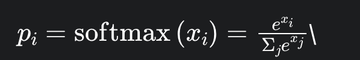

# Params

## Fundamentals of Token Selection

`
An LLM predicts the probability of the next token (a word, sub-word, or character) in a sequence. The simplest approach, greedy sampling, always selects the most likely token, which works well for classification tasks but also lead to repetitive, predictable language generation for language models. Instead, modern LLMs use sampling strategies that introduce controlled variability by selecting tokens based on their probabilities.
`

`
How does a model compute these probabilities? The model output logits (raw scores) for each token in this vocabulary. These logits are then transformed into probabilities via softmax function: 
`

## Temperature: The Creative Thermostat

`
The higher the temperature, the more evenly spread the probabilities, leading to more varied outputs. The lower it is, the more confident and deterministic the model becomes.
`

- High temperature (T > 1): Flattens the probabilities distribution, giving unlikely tokens a better chance
- Low temperature (T < 1): Sharpens the distribution, favoring high-probability tokens
- Temperature = 0: A special case - forces the model to always pick the most likely token (greedy decoding). Outputs are deterministic but risk repetition

**Image an AI chef crafting a recipe:**

- T = 0: The chef only uses the most obvious ingredients (eg: "salt"), Safe but boring
- T = 0.7: The chef adds a pinch of unexpected species (eg: "saffron"), Balanced and tasty
- T = 1.5: The chef tosses in jackfruit, chili powder, and maple syrup

**When to use it**

- T = 0: Debugging, factual QA, or code generation
- T = [0.5, 0.9]: Most conversational tasks (eg: chat-bots)
- T >= 1.0: Brainstorming or experimental writing

## Top-k: The Shortlist Selector

`
Top-k helps reduce computation without sacrificing the diversity of the models's response. Instead of evaluating every possible word in the models vocabulary, the model focuses on the k most probable candidates, softmax is applied to generate probabilities.
`

- Low k (eg: 10): Conservation, predictable outputs
- High K (eg: 100): Diverse but potentially incoherent

**Image an AI chef crafting a recipe:**

- Top-k = 1: The chef always picks the most probable ingredient (boring but safe)
- Top-k = 10: The chef picks from the top 10 most likely ingredients, adding diversity
- Top-k = 50+: The chef considers a much broader range, leading to more surprising results

**When to use it**

- Use small k for tasks requiring strict focus
- Larger k words for creative writing or marketing copy

## Top-p (Nucleus Sampling): THe Adaptive Filter

`
While Top-k picks a fixed number of options, Top-p (nucleus sampling) is more flexible, it adjusts dynamically based on context. Top-p works by summing probabilities of the most likely words until a threshold (p) is met. For example, with top-p = 0.9, the model considers the fewest words that collectively hold 90% probability giving flexibility while keeping things relevant. The higher the top-p value, the wider the selection pool, adding more variety.
`

**Imagine the chef stops adding ingredients once the chosen ones make up a significant portion of the recipe**

- Top-p = 0.9: The LLM picks from the smallest set of words that collectively hold 90% probability
- Top-p = 0.99: More variety, but still somewhat controlled
- Top-p = 1.0: Equivalent to pure random sampling

## Frequency & Presence Penalty

`
While temperature, top-k and top-p control randomness, two additional parameters refine repetition and novelty (Frequency Penalty, Presence Penalty)
`

### Frequency Penalty

`
Reduces the likelihood of tokens that have already appeared frequently in the generated text
`

- Higher values: Less repetition (great for avoiding redundant phrases like "In conclusion ... In conclusion ...")
- Lower values: Allows natural repetition (useful for poetic refrains or technical terms)

### Presence Penalty

`
Penalties tokens that have appeared at all in the generated text, encouraging the model to introduce new topics or vocabulary
`

- Higher values: More novel concepts and word choices (good for brainstorming or exploratory writing)
- Lower values: Stays tightly focused on the existing context (ideal for QA or summaries)

##Pro Tips##

- If you are seeing repeat phrases in the output, increase frequency penalty
- If outputs feel stale or lack new ideas, boost presence penalty

## How to choose the right setting?

- Factual & Consistent Output: Temperature = 0, Top-k = 1 (greedy), Top-p = 0.9
- Balanced Creativity & Coherence: Temperature = 0.7, Top-k = 40, Top-p = 0.9
- Maximum Creativity & Exploration: Temperature = 1.2, Top-k = 100, Top-p = 0.95

**Quick Cheat Sheet:**

- Need facts: T = 0, Top-k = 1, Top-p = 0.9
- Casual chatbot: T = 0.8, Top-k = 40, Top-p = 0.9
- Wild creativity: T = 1.2, Top-k = 100, Top-p = 0.95

*For most application, Temperature = 0.7 & Top-p = 0.9 strike the best balance between creativity and coherence*

**Reference**

- [The Art of Sampling: Controlling Randomness in LLMs](https://www.anup.io/p/the-art-of-sampling-controlling-randomness?r=eggp6&utm_medium=ios&triedRedirect=true)