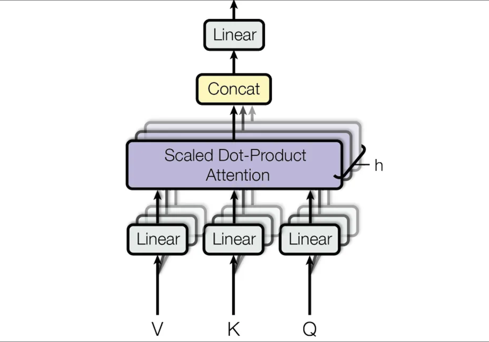
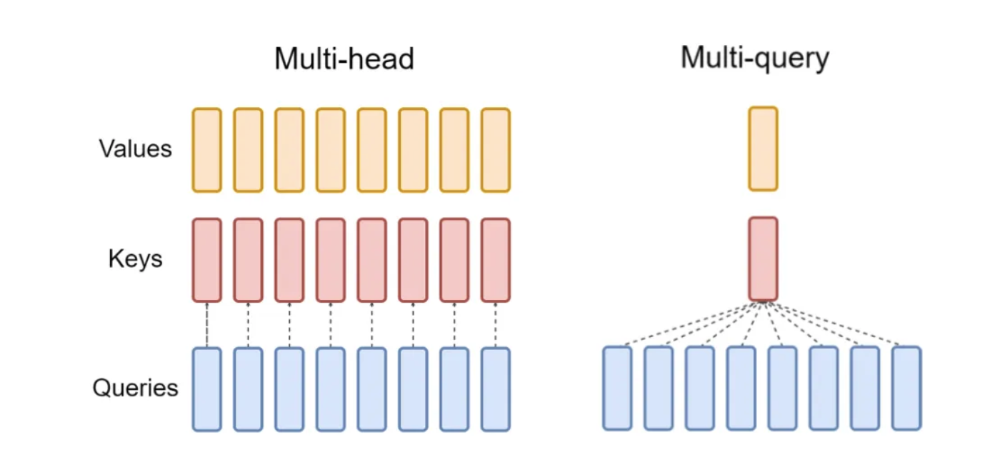
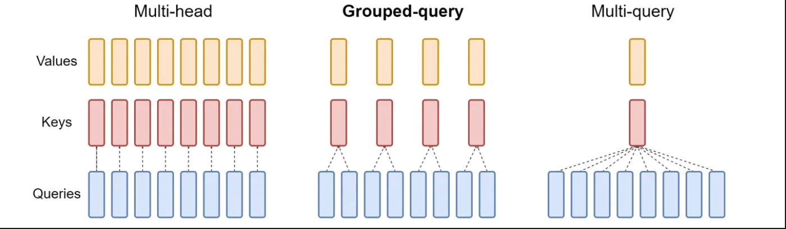
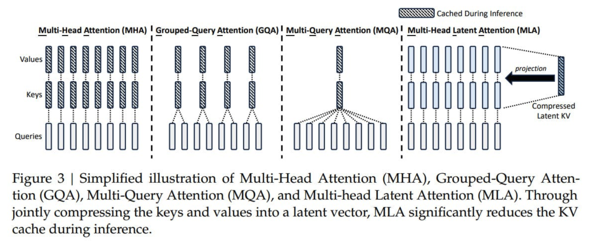

# MHA Vs MQA Vs GQA Vs MLA

## MHA (Multi Head Attention)

`
Instead of calculating the attention score just once, the Transformer runs multiple Attention mechanisms in parallel using multiple heads.
Each head focuses on different aspects of the input sequence (short vs long-range dependencies, grammatical rules, etc).
`

$$
Q_i = XW_i^Q, \quad K_i = XW_i^K, \quad V_i = XW_i^V
$$

- The matrices $W_i^Q$, $W_i^K$, $W_i^V$ projects X into lower-dimensional Query, Key, and Value vectors for each attention head

$$
d(k) = d(v) = d(model) / h
$$

- d(model) is the dimension of the input vector
- h is the number of attention heads

$$
\mathrm{head}_i = \mathrm{Attention}(Q_i, K_i, V_i) = \mathrm{softmax} \left( \frac{Q_i K_i^T}{\sqrt{d_k}} \right) V_i
$$

$$
\mathrm{MultiHead}(Q, K, V) = \mathrm{Concat}(\mathrm{head}_1, \ldots, \mathrm{head}_h)W^O
$$

- These individual Attention scores are concatenated and linearly transformed using a learned matrix W(0)

#### MHA Is Memory Expensive At Inference

When the LLM generates a token, it must compute the attention scores with all the previous tokens.

Instead of recomputing all keys and values for previous tokens at every time step, they are stored in a Key-Value(KV) Cache.

`
Queries are not cached since they are dynamically calculated for each new token, and only Keys and Values need to reused for future tokens.
`

For transformer with L layers, n(h) heads per layer, and the per-head dimension is d(h), system need to use **2 * n(h) * d(h) * L** cached for each token.

`
The cache can become massive over time, especially in long-context models, leading to massive GPU memory usage during cache retrieval and slower inference.
`

## MQA （Multi Query Attention）

`
MQA shares a single set of keys and values across all heads
`

$$
Q_i = XW_i^Q, \quad K_{\text{shared}} = XW^K, \quad V_{\text{shared}} = XW^V
$$

This reduces the KV cache size from 2 * n(h)  * d(h) * L (as in MHA) to 2 * d(h) * L

Since only one set of keys and values needs to be fetched, this reduces GPU memory usage, allowing large batch sizes to be processed at inference time.

This makes the inference much faster and, at the same time, allows the LLM to learn its representations effectively.

## GQA (Grouped Query Attention)

`
Since all heads share the same Keys and Values, this reduce effective learned representations, making the LLM less expressive and struggling to track long-range dependencies.
`

`
Instead of one KV pair per head (like in MHA) or one KV pair for all heads (like in MQA), GQA groups multiple heads together that share a single KV pair.
Each group processes its own set of queries but share the same keys and values.
`

This reduces the KV cache size from 2 * n(h) * d(h) * L (as in MHA) to 2 * d(H) * G  (where G is the number of groups)

### MLA (Multiple Head Latent Attention)

`
Through jointly compressing the keys and values into a latent vector, MLA significantly reduces the KV cache during inference.
`

`
The MLA utilities low-rank key-value joint compression to eliminate the bottleneck of inference-time key-value cache, thus supporting efficient inference. The code of MLA is the low-rank-joint compression for keys and values to reduce KV cache.
`

**Reference**

- [Deep-Diving & Decoding The Secrets That Make DeepSeek So Good](https://substack.com/home/post/p-157243999)
- [MHA vs MQA vs GQA vs MLA](https://medium.com/@zaiinn440/mha-vs-mqa-vs-gqa-vs-mla-c6cf8285bbec)
- [DeepSeek Technical Analysis - (2) Multi-Head Latent Attention](https://dataturbo.medium.com/deepseek-technical-analysis-2-mla-74bdb87d4ad2)

