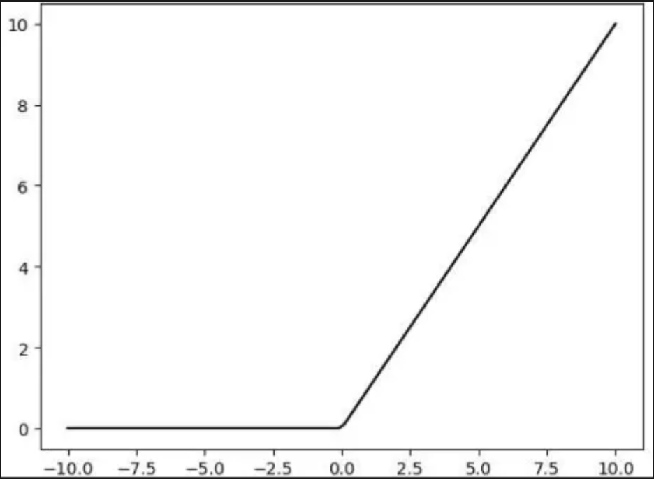
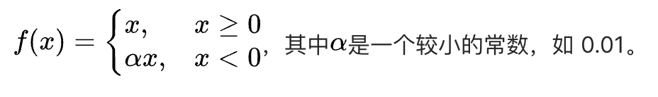
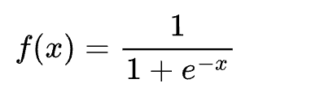
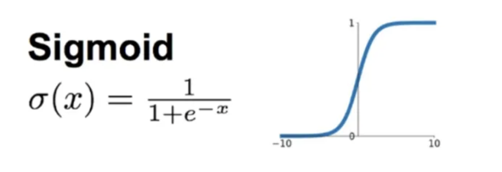
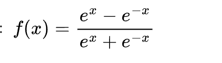
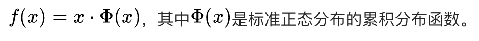
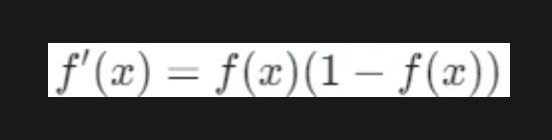

# Activation

## 激活值

`
在大语言模型（LLM）中，激活值（Activation Values）是神经网络在处理输入数据时，各层神经元或计算单元输出的中间结果。它们表示了模型在特定输入下，不同层级的特征表达和计算状态。
`

### 激活值的定义

#### 基本概念

在神经网络的前向传播中，输入数据经过每一层的线性变换（如矩阵乘法）和非线性激活函数（如 ReLU、GeLU 等）处理后，产生的输出即为该层的激活值

#### 具体场景

**在 Transformer 架构中，激活值包括：**

- 自注意力机制：查询（Query）、键（Key）、值（Value）矩阵的中间结果，以及注意力权重计算后的输出
- 前馈神经网络（FFN）：每个神经元通过非线性函数后的输出
- 层归一化（LayerNorm）后的结果：归一化后的特征表示

### 激活值的作用

#### 信息传递与非线性建模

**特征抽取**

`
每一层的激活值将输入数据逐步转化为更高层次的抽象表示
`

- 底层可能捕捉词汇、语法特征
- 高层可能建模语义、逻辑关系

**非线性能力**

`
激活函数（如 RelU）通过引用非线性，使模型能够拟合复杂的数据分布。例如，生成文本时，激活值的非线性组合帮忙模型选择下一个最可能的词
`

#### 上下文动态建模

**自注意机制**

`
在 Transformer 中，激活值通过注意力权重动态聚合不同位置的上下文信息。例如：当模型处理句子中的代词（如 it）时，激活值会反应该代词所指代的具体实体
`

**动态计算**

`
激活值在推理时实时生成，与静态的模型参数（权重）不同，它反映当前输入的特征和上下文关系
`

#### 知识存储与推理

**参数 Vs 激活值**

- 参数（权重）：存储模型从训练数据中学到长期知识（如语法规则、事实性知识）
- 激活值：在推理时动态生成，体现模型对当前输入的处理过程，是参数知识在具体上下文中的 "实例化"

**生成文本**

- 在生成式任务在（如对话、续写）中，每一步激活值界定下一个词的生成概率分布

### 激活值的实际意义

- 模型的可解释性：通过分析激活值，可以理解模型内部的决策逻辑（如使用可视化工具观察注意头的关注区域）
- 模型优化：激活值的分布（如稀疏性、范围）可指导模型压缩（如量化）或改进训练稳定性（如梯度消失/爆炸问题）
- 高效计算：激活值的内存占用和计算效率直接  影响推理速度，是硬件优化（如 GPU 显存管理）的关键考量

### 示例说明

`
假设输入句子是 "The cat sat on the ___.", 模型需要预测最后一个词（如 "mat"）
`

- 输入嵌入层：将每个词转换为向量，激活值表示词嵌入
- 自注意力层：激活值反映 "cat" 与 "sat" 的关系，以及 "on" 与待预测位置的关联
- 前馈网络：激活值进一步组合特征，最终输出 "mat" 的概率最高

## FFN (前馈神经网络 - Feed Forward Neural Network)

`
FFN 是前馈神经网络的缩写，通常也被称为前馈层
`

### FFN 的结构与组成

- FFN 一般由两层全连接层组成，中间夹着一个非线性激活函数。在 Transformer 架构的 LLM 中，FFN 通常作用于每个 Transformer 块内
- 输入首先经过一个线性变换（全连接层），将输入映射到一个更高纬的空间，然后应用激活函数引入非线性，最后再经过另一个线性变换（全连接层）将维度还原到与输入相同或其他指定的维度
- FFN 中非线性激活函数能够让模型学习到更复杂的函数关系，使 LLM 可以处理各种非线性问题，捕捉语言中的复杂语义和句法结构。比如，在理解句子 "苹果是红色的" 和 "红色的苹果" 时，FFN 可以通过非线性变换来区分不同的语义结构

### 常见激活函数

#### ReLU (Rectified Linear Unit)

**表达式**

f(x) = max(0, x)

`
计算简单，能有效缓解梯度消失问题，使模型更容易训练和收敛，还能加快训练速度。但存在神经元 "死亡" 问题，当输入小于 0 时，导致神经元在训练中无法更新
`

- 当输入大于 0 时，输出就是输入值本身
- 当输入小于 0 时，输出为 0
- 简单而有效的非线性变换，使得 ReLU 函数在深度学习中得到广泛应用（帮助神经网络快速收敛，有效缓解梯度消失问题）

#### Leaky ReLU

**表达式**

`
解决 ReLU 中神经元 "死亡" 的问题，当输入为负数时，仍有一个较小的梯度，使神经元在负数域也能进行更新学习
`

#### Sigmoid

**表达式**

`
输出值在 (0, 1) 之间，可将实数映射到 0 到 1 的区间，用于表示概率或对输出进行归一化。但容易出现梯度消失问题，在输入值较大或较小时，梯度趋近于 0，导致训练困难，收敛速度慢
`

- 函数图像呈现出一种 S 形曲线
- 将输入值应到到 0 到 1 之间的区间
- 当输入值非常大时，函数输出接近于 1，当输入值非常小时，函数输出接近于 0
- 通过将神经元的加权和结果输入到 Sigmoid 函数中，神经元的输出就被限制在一个特定的范围内，并且具有了非线性的特征

#### Softmax

- 将一个数值向量转换为表示各个类型概率的概率分布向量
- 对输入向量中的每个元素进行指数运算，然后再将这些指数化后的值进行归一化，使得输出向量的元素之和为 1，从而表示各个类型的概率分布

#### Tanh

**表达式**

`
输出值在（-1, 1）之间，均值为 0，相比 sigmoid 函数，tanh 函数在 0 附近的梯度更大，收敛速度更快。但同样存在梯度消失问题
`

#### GELU (Gaussian Error Linear Unit)

**表达式**

`
具有平滑的非线性特性，能更好地拟合数据中复杂的关系，在语言模型等任务中表现出较好的性能，有助于提高模型的泛化能力和准确性
`

### 激活函数的比较

#### Sigmoid 函数

- 在二分类任务中表现出色，通常希望将输入数据映射到 0 和 1 两个类别上（例如判断邮件是否为垃圾邮件）
- 函数的导数计算相对简单，但容易出现梯度消失问题，导致训练困难
- 在深度学习网络中，反向传播时梯度是逐层相乘的，如果某一层梯度非常小，经过多层传递后，梯度会变得极其微小，几乎为 0，导致前面的层无法有效地更新权重，使得网络的训练变得非常困难，甚至无法收敛

**Sigmoid 的函数的导数公式为：**

- 当 x = 5 时，导数为 0.0067
- 当 x = 10 时，导数为 0.000045
- 梯度值急剧下降，导致梯度消失问题

#### ReLU 函数

- 在神经网络的前向传播中，若使用 ReLU 函数，计算量远小于 Sigmoid 函数。大大减少了模型的计算时间，提高了训练和预测效率
- 函数在输入值大于 0，其导数恒为 1，当 x < 0 时，其导数为 0（在反向传播过程中，只要神经元的输入大于 0，就能够正常传递梯度，避免了梯度消失问题，使得深度神经网络的训练更加稳定和有效）
- ReLU 函数会使得一步神经元的输出为 0，这就导致神经元死亡问题，虽然神经元死亡会给网络带来稀疏性的好处，但若大量的神经元死亡，会导致神经网络无法工作

**网络稀疏性的好处**
- 减少神经元之间的冗余连接，使得网络更加简洁，降低了过拟合的风险
- 稀疏的网络结果可以减少计算量和存储需求
- 对不重要的特征对应的神经元输出为 0，从而提高模型的泛化能力和对重要特征的提取能力

#### Softmax 函数

- Sigmoid 函数主要用于二分类问题，将一个实数映射到 0 到 1 之间，表示属于某一类别的概率
- Softmax 函数在多分类场景下的扩展，能够处理多个类别情况，将一个实数向量映射到 0 到 1 之间的概率分布，每个元素表示对应类别的概率
- Softmax 的应用示例，输入一张图片，神经网络通过 Softmax 输出它属于不同类别的（如猫、狗、汽车等）概率

**Reference**

- [从线性到非线性：激活函数](https://mp.weixin.qq.com/s/K18qH70T0gKGPkeRIUeccA)

