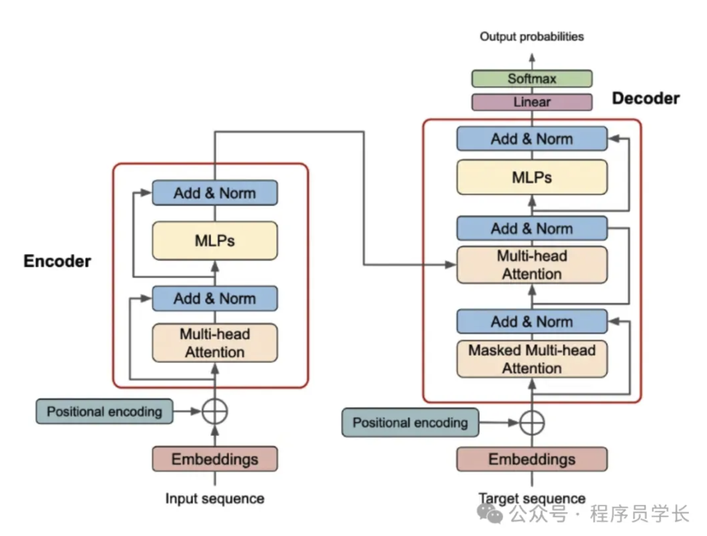
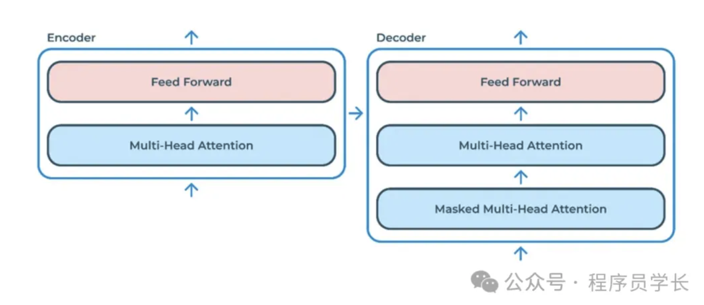
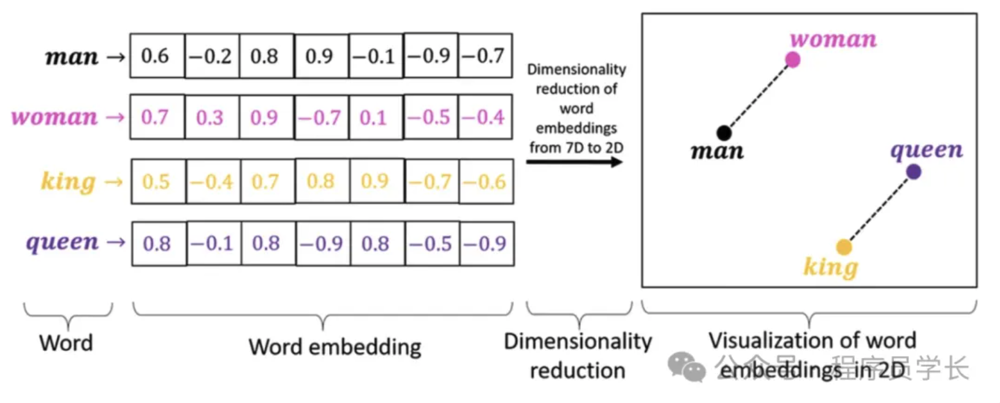
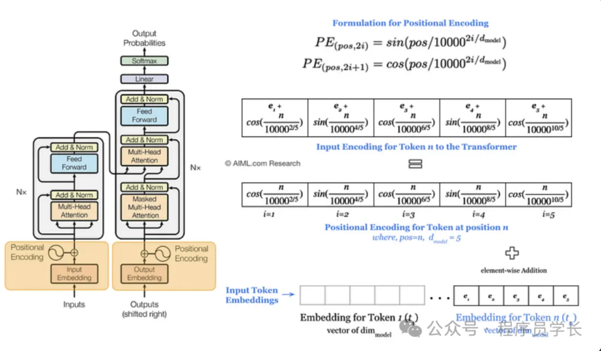
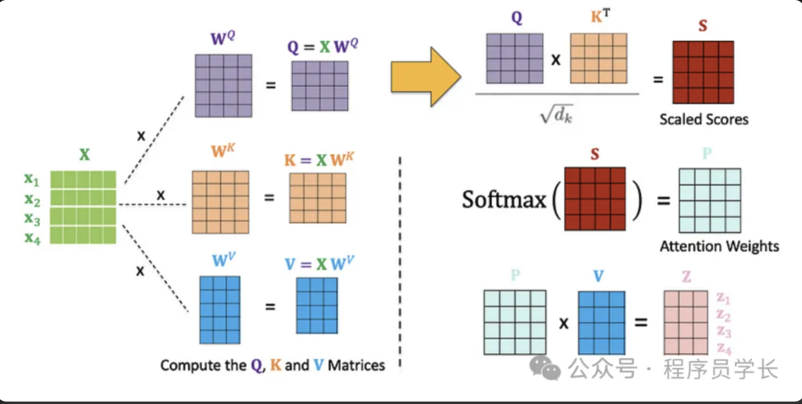
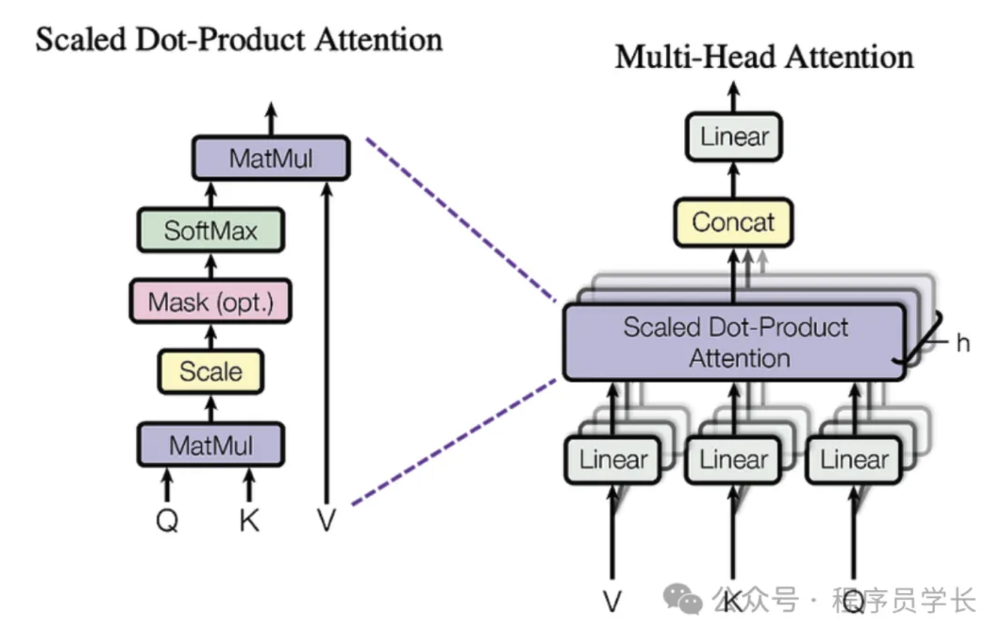
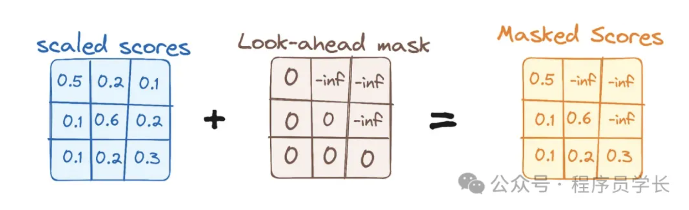

# Transformer

`
与之前的递归神经网络 RNN 和长短期记忆网络 LSTM 相比，Transformer 通过注意力机制（Attention Mechanism）来捕捉序列中各个元素之间的依赖关系，从而避免传统序列模型在处理长序列时的梯度消失或爆炸的问题，显著提高了并行计算的能力，并且在处理长序列时具有更好的效果
`

## 整体架构

- Transformer 模型主要由两部分组成，编码器（Encoder）和解码器（Decoder）
- 编码器用于将输入序列映射到一个连续的表示
- 解码器则根据这个消失生成输出序列

### 编码器

**编码器将输入序列转换为一系列的特征表示**

- 由 N 个相同层堆叠而成，每个层包括连个主要子层
  - 多头自注意力（Multi-Head Self-Attention）
  - 前馈网络（Feed-Forward Network）
- 每个子层后都采用残差连接和层归一化，用于提高模型训练的稳定性，加速收敛

### 解码器

**解码器根据编码器生成的表示和解码器的历史输出，逐步生成目标序列（例如翻译后的文本）**

- 由 N 个想同层堆叠而成，每个层包括三个主要子层
  - 掩蔽多头自注意力机制（Masked Multi-Head Self-Attention）
  - 编码器 - 解码器注意力机制（Encoder-Decoder Attention）
  - 前馈神经网络（Feed-Forward Network）
- 与编码器类似，每个子层后也采用了残差连接和层归一化

## 核心组件

### 输入嵌入

在 Transformer 中，输入嵌入层将每个词（或子词）映射为一个 d 维的向量

### 位置编码

由于 Transformer 模型没有显式的递归结构，无法直接捕捉序列中元素的顺序信息。因此，必须通过位置编码来为每个输入词向量添加位置信息，使得模型能够理解词语在序列中的相对位置

**常见的实现方法是使用正弦和余弦函数生成的位置编码：**

- k 是位置编码的维度索引
- i 是词的位置（例如序列中第 i 个词）
- d 是嵌入维度

### 自注意力机制

`
自注意力机制是 Transformer 的核心，它通过计算输入序列中的每个元素与其他元素的相关性，来捕捉序列中的全局依赖关系
`

#### 输入

假设我们有个输入矩阵 $X \in \mathbb{R}^{n\times d}$ ，其中 n 是序列长度，d 是每个词的维度

#### 生成查询、键、值（Q、K、V）矩阵

将输入矩阵 X 分别通过线性变换得到查询（Query）、键（Key）和值（Value）矩阵：

$Q = XW_Q,\ K = XW_K,\ V = XW_V$

其中 $W_Q, W_K, W_V$ 是训练得到的权重矩阵

#### 计算注意力得分

通过计算查询 Q 和键 K 的点积来衡量它们之间的相似性，然后对其进行缩放（除以 $\sqrt{d_k}$）以避免梯度消失或爆炸

$Attention\ scores = \frac{QK^T}{\sqrt{d_k}}$

#### 应用 softmax 函数

对注意力得分进行 softmax 操作，得到归一化的权重

$Attention\ weights = \text{softmax}\left(\frac{QK^T}{\sqrt{d_k}}\right)$

#### 加权求和

将注意力权重与值矩阵 V 相乘，得到加权后的输出

 $Output = Attention\ weights\cdot V$

### 多头注意力机制

多头自注意力将查询、键、值矩阵分别分割成 h 组，然后独立计算每组的注意力，最后将这些注意力结果拼接在一起，并通过一个线性变化得到最终输出

$ \text{MultiHead}(Q, K, V) = \text{Concat}(\text{head}_1, \ldots, \text{head}_h)W^O$

其中，$ \text{head}_i = \text{Attention}(QW_i^Q, KW_i^K, VW_i^V)$ 为每个头的输出，$W^O$ 是最终的线性变换矩阵

### 前馈神经网络

前馈神经网络是 Transformer 中每个编码器的解码器层的组成部分，用于进一步提取特征

**前馈神经网络通常由两个全连接层和一个激活函数（如 ReLU）组成**

$ \text{FFN}(x) = \max(0, xW_1 + b_1)W_2 + b_2$

其中 $W_1$ 和 $W_2$ 是全连接层的权重矩阵

**FFN 的作用是对每个位置的表示进行独立的非线性变换，增强模型的表达能力**

### 残差连接

在 Transformer 中，所有的子层（如自注意力、前馈神经网络）都采用了残差连接

残差连接通过将子层的输入直接添加到子层的输出，缓解了深层网络中的梯度消失问题，帮忙模型训练更深层的网络

$ \text{LayerNorm}(x) = \frac{x - \mu}{\sigma} \cdot \gamma + \beta$

其中，$ \mu$ 和 $\sigma$ 分别是输入 x 的均值和标准差，$ \gamma$ 和 $\beta$ 是可学习的参数，分别用于缩放和平移归一化的结果

### 掩蔽多头自注意力机制

在 Transformer 的解码器中，掩蔽多头注意力机制用于确保生成的每个词时，只能依赖当前和之前生成的单词，而不能 "看到" 未来的单词

掩蔽多头自注意力机制的实现与普通的多头自注意力机制类似，区别在于在计算自注意力得分时对未来的位置进行屏蔽

假设输入的序列长度为 n，每个词向量通过线性变换得到查询（Q）、键盘（K）和值（V）向量，标准的自注意力计算过程如下：

$ \text{Attention}(Q, K, V) = \text{softmax}\left(\frac{QK^T}{\sqrt{d_k}}\right)V$

但在掩蔽多头自注意力中，添加了一个掩蔽矩阵 M。掩蔽矩阵的目的是使得模型在预测时无法看到未来的信息

$ \text{Masked Attention}(Q, K, V) = \text{softmax}\left(\frac{QK^T}{\sqrt{d_k}} + M\right)V$

其中：M 是掩码矩阵

$M_{ij}=\begin{cases}0 & 如果\ j\leq i\\-\infty & 如果\ j > i\end{cases}$

掩码矩阵中的负无穷值在 softmax 操作后会变为零，即不会对最终的注意力权重产生影响，从而确保当前位置只关注当前和之前的词

### 编码器 - 解码器注意力机制

**允许解码器在生成输出时，能够关注到编码器的输出**

编码器 - 解码器注意力机制的查询向量 Q 来自解码器当前时刻的输入，键向量 K 和 值向量 V 来自编码器的输出。因此，解码器的每个位置都会关注到整个输入序列的信息，帮忙解码器生成更符合上下文的输出

$ \text{Encoder-Decoder Attention}(Q, K_{\text{encoder}}, V_{\text{encoder}}) = \text{softmax}\left(\frac{QK_{\text{encoder}}^T}{\sqrt{d_k}}\right)V_{\text{encoder}}$

- Q 来自解码器当前时刻的输入，$K_{\text{encoder}}$ 和 $V_{\text{encoder}}$ 来自编码器的输出

**Reference**
- [终于把 Transformer](https://mp.weixin.qq.com/s/uMICN3Qi4IZJGhtnmuaaGQ)
