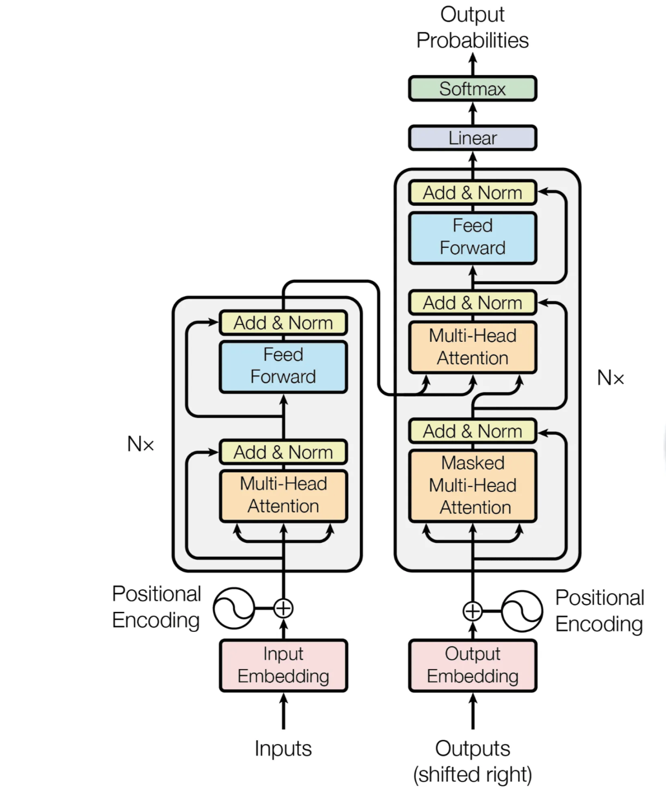

# Transformer Mathematic

## Table of Contents

- Defining our DataSet
- Finding Vocab Size
- Encoding
- Calculating Embedding
- Calculating Positional Embedding
- Concatenating Positional and Word Embeddings
- Multi Head Attention
- Adding and Normalizing
- Feed Forward Network
- Adding and Normalizing Again
- Decoder Part
- Understanding Mask Multi Head Attention
- Calculating the Predicted Word

**Reference**

- [Solving Transformer by Hand: A Step-by-Step Match Example](https://levelup.gitconnected.com/understanding-transformers-from-start-to-end-a-step-by-step-math-example-16d4e64e6eb1#e273)